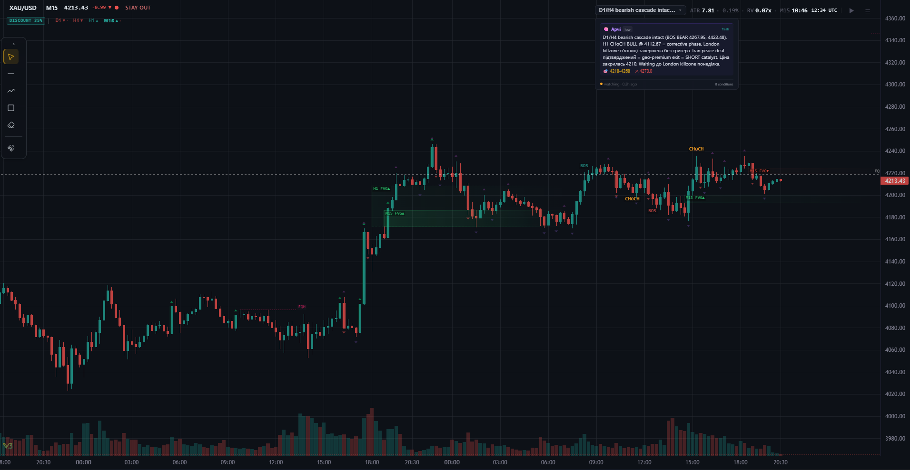

# Trading Platform v3 (FXCM Connector + UDS + UI)

[](https://github.com/Std07-1/v3/actions/workflows/ci.yml)
[](LICENSE)




**Real-time Smart Money Concepts (SMC) analytics for gold, indices and crypto** — a
broker-grade data pipeline (FXCM / Binance) feeding a live WebSocket chart, wired over
Redis to **Archi**, an autonomous Claude trading agent that reasons, remembers, and
decides for itself.

**▶ Live: [aione-smc.com](https://aione-smc.com/)**

### Why it isn't just another trading bot

- **Autonomy-first AI agent** — Archi sets its own wake conditions, runs a 7-layer
  memory, writes its own market thesis, and is *never silently overridden*. Code
  advises; the agent decides (constitutional invariant **I7**).
- **Hard data invariants** — a single `UnifiedDataStore` write-center, `Final > Preview`,
  degraded-but-loud (no silent fallbacks). Every non-trivial decision is captured in
  **47+ ADRs**.
- **$0 analytics** — SMC structure (BOS / CHoCH), order blocks, FVG, liquidity,
  premium/discount and confluence scoring are computed **in-process** — no paid
  signal feeds.
- **Built like production** — dual-venv broker isolation, exit-gates, security scan,
  green CI, and a real FXCM real-time stream. Maturity is tracked honestly (**M3 → M7**),
  not faked.

> **⚠️ Not financial advice.** Analytical / research tool only — SMC labels are technical
> markers, not signals. Trading carries substantial risk of loss. Full terms:
> **[DISCLAIMER.md](DISCLAIMER.md)** · [LICENSE](LICENSE).

---

Торгова платформа "дані → аналітика/SMC → UI → торгова взаємодія" з жорсткими інваріантами та **UnifiedDataStore (UDS)** як єдиним write-center.

## Канон A → C → B

| Шар | Що | Де |
|---|---|---|
| **A** Broker + ingest | FXCM/Binance History + tick stream → writer-процеси | `runtime/ingest/`, `app/` |
| **C** UDS | SSOT disk + Redis cache + updates bus | `runtime/store/uds.py` |
| **B** UI (ws) | read-only WS real-time renderer, same-origin, порт 8000 | `ui_v4/` + `runtime/ws/ws_server.py` |
| **TUI** | aione-top: інтерактивний TUI-монітор процесів/pipeline | `aione_top/` |

## Ключові принципи

- **SSOT**: один UDS, один `config.json`, один TF allowlist.
- **NoMix / Final > Preview**: `complete=true` завжди перемагає; два різні final source для одного ключа заборонені.
- **Degraded-but-loud**: жодних silent fallback — лише `warnings[]` / `meta.degraded[]`.
- **Disk hot-path ban**: disk лише для bootstrap/scrollback/recovery; interactive = RAM/Redis. Scrollback: max_steps=6, cooldown 0.5s.
- **Часова геометрія (dual convention)**: CandleBar/SSOT/API = end-excl (`close_time_ms = open + tf_s*1000`); Redis ALL = end-incl (`close_ms = open + tf_s*1000 - 1`). Конвертація на межі Redis write.

## Quickstart

### 1. Встановлення

```powershell
# Main venv (Python >=3.11) — платформа, UDS, derive, SMC, UI
python -m venv .venv
.venv\Scripts\activate
pip install -r requirements.txt

# Broker venv (Python 3.7) — forexconnect SDK (.venv37/)
C:\Python37\python.exe -m venv .venv37
.venv37\Scripts\pip install -r requirements-broker.txt

# UI v4 frontend (Svelte 5 + Vite)
cd ui_v4
npm install
npm run build
cd ..

# Секрети
cp .env.example .env   # відредагуй FXCM_USER / FXCM_PASS / FXCM_URL
```

### 2. Запуск

Платформа складається з 6 незалежних процесів. Кожен запускається окремо —
це дозволяє перезапускати UI (ws_server) за 3 секунди без зупинки data pipeline.

| Процес | `--mode` | Що робить |
|--------|----------|-----------|
| M1 poller | `m1_poller` | broker_sidecar + m1_ingestion + derive cascade |
| Broker sidecar | `broker_sidecar` | FXCM M1 fetch + tick relay V2 (.venv37/) |
| Tick preview | `tick_preview` | ticks → preview bars |
| Binance ingest | `binance_ingest_worker` | BTCUSDT/ETHUSDT M1 + backfill |
| Binance ticks | `binance_tick_publisher` | Binance live ticks → Redis |
| WS server | `ws_server` | UI backend, порт 8000 |

```bash
# Кожен у окремому терміналі:
python -m app.main --mode <mode> --stdio pipe

# Або все разом (legacy, НЕ рекомендується для dev):
python -m app.main --mode all --stdio pipe
```

Повний cheat-sheet з усіма командами (локальний + VPS): **[docs/runbooks/commands.md](docs/runbooks/commands.md)**

> **Dual-venv (ADR-0016)**: Supervisor автоматично використовує `.venv37/` для broker_sidecar
> (M1 fetch + tick relay V2) і `.venv/` для всього іншого.
> `tick_publisher_fxcm` — зупинений назавжди (FXCM dual-session conflict).
> PID-локи per-mode: `logs/supervisor_{mode}.pid` — дозволяє паралельний запуск.

## Quality Gates

```bash
python -m tools.run_exit_gates --manifest tools/exit_gates/manifest.json
```

Якщо gates FAIL → формальний **NO-GO** до наступних PATCH.

## Automation Baseline

- GitHub Actions: Python smoke tests + UI v4 typecheck/build на кожен push і pull request
- Dependabot: weekly dependency updates для `pip` і `npm`
- Мета: замкнути базовий enforcement-контур для governance, SSOT smoke та frontend compile health

## Документація (SSOT)

Повна документація: **[docs/index.md](docs/index.md)** — єдина точка входу.

| Документ | Опис |
|---|---|
| [docs/index.md](docs/index.md) | Навігація по всій документації |
| [docs/system_current_overview.md](docs/system_current_overview.md) | Архітектура, процеси, схеми, інваріанти |
| [docs/contracts.md](docs/contracts.md) | Реєстр контрактів (bar_v1, window_v1, updates_v1, tick_v1) |
| [docs/ui_api.md](docs/ui_api.md) | HTTP API reference (endpoints, guards, TTL) |
| [docs/config_reference.md](docs/config_reference.md) | Довідник полів config.json |
| [docs/runbooks/production.md](docs/runbooks/production.md) | Production runbook (запуск, інциденти, recovery) |
| [docs/audit/progress.md](docs/audit/progress.md) | Аудит прогресу P0-P6 з evidence |
| [docs/adr/index.md](docs/adr/index.md) | Реєстр усіх ADR (canonical archive) |
| [docs/adr/0001-unified-data-store.md](docs/adr/0001-unified-data-store.md) | ADR: UDS як єдина талія |
| [docs/adr/0002-derive-chain-from-m1.md](docs/adr/0002-derive-chain-from-m1.md) | ADR: DeriveChain M1→M3→M5→H4 (Phase 0 завершено) |
| [docs/adr/0003-cold-start-hardening.md](docs/adr/0003-cold-start-hardening.md) | ADR: Cold start hardening (S1 ✅, S2 ✅, S3-S4 pending) |
| [docs/system_spec/UI_v4_DISCOVERY_AUDIT_rev2.md](docs/system_spec/UI_v4_DISCOVERY_AUDIT_rev2.md) | UI v4 audit: T1-T10 ALL COMPLETE, chart parity DONE |

```text
┌─────────────────────────────────────────────────────────────┐
│  LAYER 1: INGEST (simple, focused, single-responsibility)   │
│                                                             │
│  ┌──────────────┐    ┌──────────────────┐                   │
│  │ m1_poller    │    │ binance_ingest   │                   │
│  │ M1 від FXCM  │    │ M1 від Binance   │                   │
│  └──────┬───────┘    └──────┬───────────┘                   │
│         │ commit M1         │ commit M1                     │
│         ▼                   ▼                               │
│  ┌──────────────────────────────────┐                       │
│  │            UDS (SSOT)            │                       │
│  └──────────────┬───────────────────┘                       │
│                 │ updates bus (Redis pub/sub)               │
└─────────────────┼───────────────────────────────────────────┘
                  │
                  ▼
┌─────────────────────────────────────────────────────────────┐
│  LAYER 2: DERIVE ENGINE (cascade, async, priority)          │
│                                                             │
│  ┌─────────────────────────────────────────────────┐        │
│  │          core/derive.py (PURE, no I/O)          │        │
│  │  GenericBuffer(tf_s)  +  aggregate_bars()       │        │
│  │  DERIVE_CHAIN = declarative cascade rules       │        │
│  └─────────────────────────────────────────────────┘        │
│                                                             │
│  ┌─────────────────────────────────────────────────┐        │
│  │    runtime/ingest/derive_engine.py (I/O layer)  │        │
│  │                                                 │        │
│  │  On new M1 bar →  cascade per symbol:           │        │
│  │    M1 → M3 (3×M1)                               │        │
│  │    M1 → M5 (5×M1)                               │        │
│  │      M5 → M15 (3×M5)                            │        │
│  │        M15 → M30 (2×M15)                        │        │
│  │          M30 → H1 (2×M30)                       │        │
│  │            H1 → H4 (4×H1, calendar+TV anchor)   │        │
│  │    M1 → D1 (1440×M1, anchor 22:00 UTC)          │        │
│  │                                                 │        │
│  │  4 символи (XAU/USD, XAG/USD, BTCUSDT, ETHUSDT) │        │
│  │  Priority: watched symbol → front of queue      │        │
│  │  Buffers: GenericBuffer per (symbol, tf_s)      │        │
│  └─────────────────────────────────────────────────┘        │
│         │                                                   │
│         ▼ commit derived bars                               │
│  ┌──────────────────────────────────┐                       │
│  │            UDS (SSOT)            │                       │
│  └──────────────────────────────────┘                       │
└─────────────────────────────────────────────────────────────┘
                  │
                  ▼
┌──────────────────────────────────────────────────────────────┐
│  LAYER 3: UI v4 (WS real-time, read-only, ZERO domain logic) │
│  WS full/delta/scrollback → UDS via ws_server.py             │
│  Svelte 5 + LWC 5 + TypeScript, ~40 файлів ~10000 LOC          │
│  Порт 8000, same-origin, config-gated                        │
│  Chart parity DONE, audit T1-T10 COMPLETE                    │
└──────────────────────────────────────────────────────────────┘
```

## Ліцензія

Див. [LICENSE](LICENSE).

### Сторонні залежності

Перелік сторонніх залежностей та їхніх ліцензій: [THIRD_PARTY_NOTICES.md](THIRD_PARTY_NOTICES.md)

**FXCM ForexConnect SDK**: Цей репозиторій НЕ містить і НЕ розповсюджує ForexConnect SDK. Для використання SDK кожен користувач зобов'язаний самостійно прийняти FXCM EULA та мати активний FXCM account. Детальніше: [docs/compliance/fxcm-sdk-license-review.md](docs/compliance/fxcm-sdk-license-review.md)
