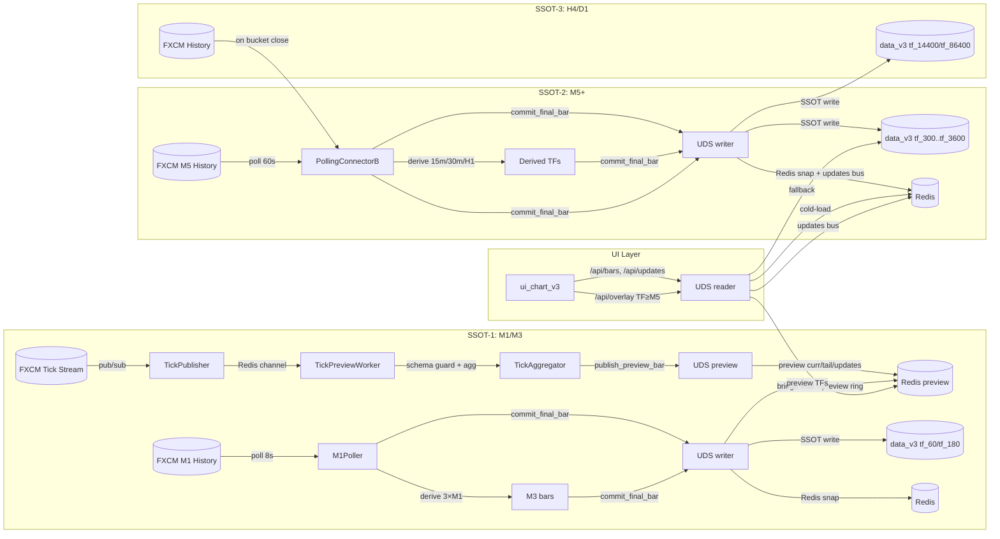
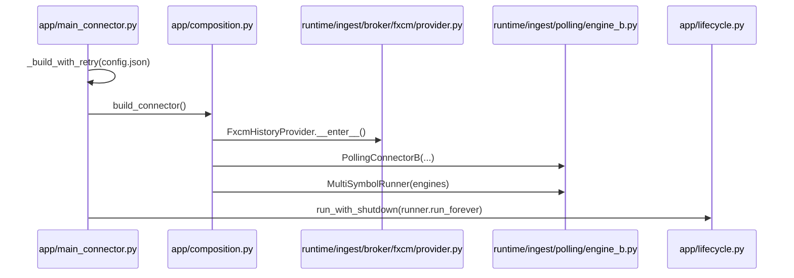
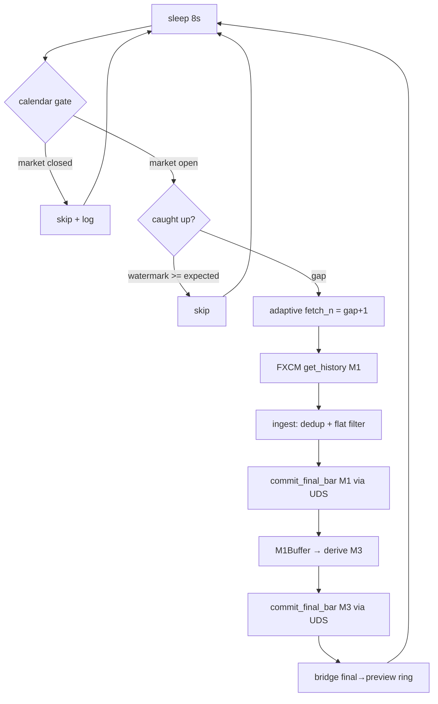
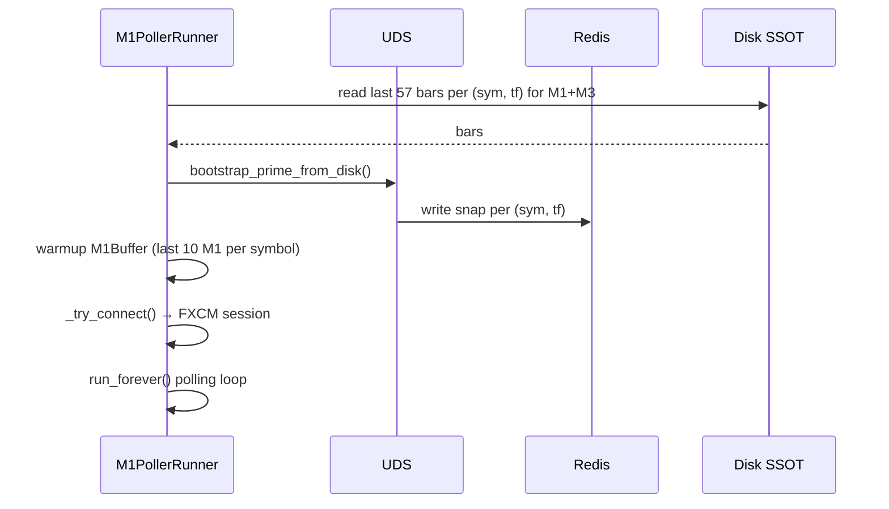
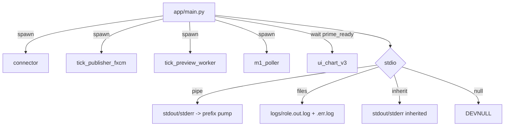
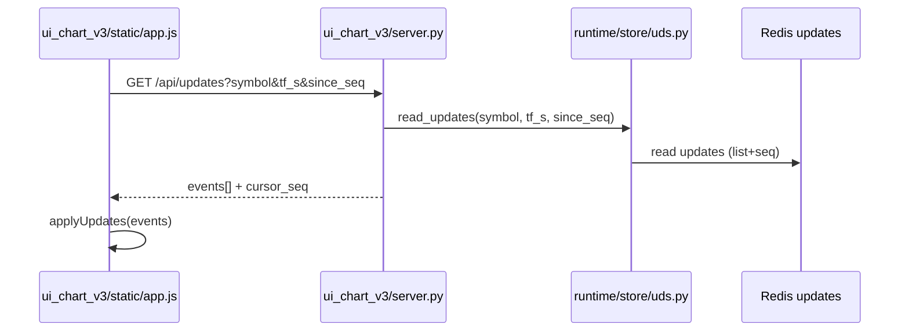
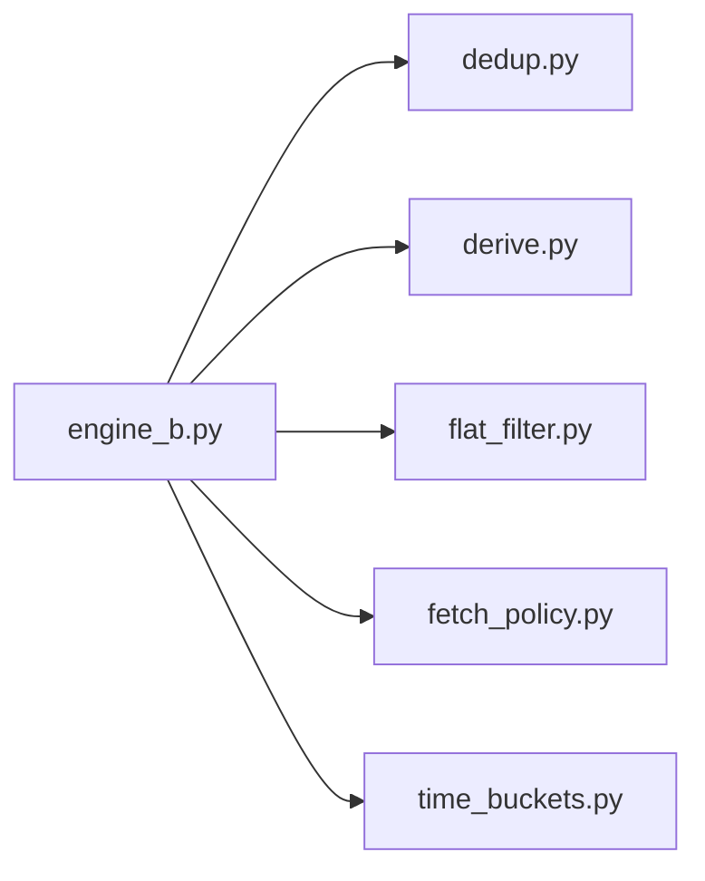

# Поточна система (M1/M3 + M5+ dual pipeline)

Цей файл описує актуальний стан системи після додавання M1/M3 pipeline.

## Короткий опис

Система має **два ізольованих потоки даних**:

- **SSOT-1 (M1/M3)** — візуальність + точки входу. M1 final bars з FXCM History API (m1_poller), M3 derived з 3×M1. Preview-plane: tick stream → TickPreviewWorker → Redis preview keyspace.
- **SSOT-2 (M5+)** — SMC аналітика. M5 з FXCM History (engine_b/connector), derived 15m/30m/H1 з M5.
- **SSOT-3 (H4/D1)** — глобальний тренд. Прямий FXCM History API fetch на закритті бакета.

Supervisor (`app.main --mode all`) керує 5 процесами. UDS є центром читання/запису: writer-и пишуть через UDS (SSOT disk + Redis snapshots + updates bus), UI читає через UDS. Preview-plane (M1/M3) живе в Redis keyspace, final-и з M1 poller проходять bridge до preview ring (final>preview). `/api/bars` для всіх TF застосовує PREVIOUS_CLOSE stitching (open[i]=close[i-1]) для TV-like smooth candles; SSOT на диску не модифікується.

## Архітектура процесів

```
app.main (supervisor)
  ├── connector             (FXCM History → UDS final → M5/derived/HTF)
  ├── tick_publisher_fxcm   (ForexConnect tick stream → Redis PubSub)
  ├── tick_preview_worker   (Redis PubSub → UDS preview M1/M3)
  ├── m1_poller             (FXCM M1 History → UDS final M1 + derive M3)
  └── ui                    (HTTP server, port 8089)
```

## SSOT-площини (ізольовані)

```
┌──────────────────────────────────────────────────────────────┐
│  SSOT-1: M1/M3 (візуальність + точки входу)                 │
│  Джерело: tick stream → preview, FXCM M1 History → final    │
│  Disk: data_v3/{sym}/tf_60/ та tf_180/                      │
│  Процеси: m1_poller (final), tick_publisher+preview_worker   │
│  Ізоляція: НЕ впливає на M5+ pipeline                       │
├──────────────────────────────────────────────────────────────┤
│  SSOT-2: M5+ (SMC аналітика)                                │
│  Джерело: FXCM M5 History → final, derived 15m/30m/H1       │
│  Disk: data_v3/{sym}/tf_300..tf_3600/                        │
│  Процес: connector (engine_b + derive)                       │
│  Незмінний pipeline (polling engine_b)                       │
├──────────────────────────────────────────────────────────────┤
│  SSOT-3: H4/D1 (глобальний тренд, структурні зони)          │
│  Джерело: FXCM History API напряму                          │
│  Disk: data_v3/{sym}/tf_14400/ та tf_86400/                  │
│  Процес: connector (broker_base fetch on close)              │
│  Незмінний pipeline (broker_base fetch)                      │
└──────────────────────────────────────────────────────────────┘
```

## Геометрія часу (помітка для всіх розмов про свічки)

- SSOT JSONL (CandleBar) тримає end-excl: `close_time_ms = open_time_ms + tf_s*1000`.
- Зовнішній контракт (HTTP API + UI) нормалізує до end-incl: `close_time_ms = open_time_ms + tf_s*1000 - 1`.
- `event_ts`/`event_ts_ms` додається лише у вихідних payload-ах для `complete=true`, не зберігається у SSOT.

Це рішення закріплено історично, щоб не ламати SSOT та уникати «дір» у даних. Будь-які зміни геометрії часу мають проходити через окремий initiative з міграцією і rollback.

## Схема (потік даних)



## Схеми процесів і циклів

### Старт і ініціалізація (connector)



### M1 Poller цикл (M1 + M3 derive)



### M1 Poller warmup (startup)



### Polling цикл (M5 + derived)

```mermaid
flowchart TD
    A[sleep_to_next_minute] --> B[log calendar state changes]
    B --> C{broker_base_fetch_on_close?}
    C -->|yes| D[fetch_last_n_tf tf=14400/86400]
    C -->|no| E[skip base TF]
    D --> F[fetch_last_n_tf tf=300 (tail)]
    E --> F
    F --> G[ingest M5 (dedup module)]
    G --> H{calendar pause?}
    H -->|trading + flat| Skip[skip flat bar]
    H -->|pause + flat| Accept_PF[accept + ext:calendar_pause_flat]
    H -->|pause + non-flat| Anomaly[WARN anomaly + accept]
    H -->|trading + non-flat| I[derive 15m/30m/1h (derive module)]
    Accept_PF --> I
    Anomaly --> I
    I --> J[commit_final_bar через UDS]
```

### Retry/backoff + календарний сон

```mermaid
flowchart TD
    A[build_connector] -->|ok| B[run_forever]
    A -->|error| C[backoff = base * 2^n]
    C --> D{ORA-499?}
    D -->|yes| E[calendar sleep до open - wake_ahead]
    D -->|no| F[time.sleep(backoff)]
    E --> A
    F --> A
```

### Supervisor (app/main.py --mode all)



### UI polling /api/updates



### UI scrollback (cover-until-satisfied)

- Тригер: дефіцит лівого буфера (~2000 барів).
- Пачки: 5000 барів (фаворити x2).
- Ліміти: active 60000 (фаворити 120000), warm LRU=6 по 20000.

### Модулі polling (залежності)



## Annotated tree (ASCII, актуальний)

```text
v3/
├── app/                           # запуск і складання runtime
│   ├── main.py                    # supervisor (--mode all/connector/ui/tick_publisher/tick_preview/m1_poller)
│   ├── main_connector.py          # retry/backoff + calendar sleep (engine_b)
│   ├── composition.py             # build_connector, build_m1_poller, валідація config.json
│   ├── lifecycle.py               # run_with_shutdown + cleanup
│   └── __init__.py
├── core/                          # pure-логіка (час, контракти, моделі) — без I/O
│   ├── config_loader.py           # SSOT: pick_config_path / load_system_config
│   ├── buckets.py                 # bucket_start_ms / resolve_anchor_offset_ms
│   ├── time_geom.py               # normalize_bar (end-incl)
│   ├── model/
│   │   └── bars.py                # CandleBar + інваріанти часу
│   └── contracts/
│       └── public/
│           └── marketdata_v1/     # JSON Schema контракти
│               ├── bar_v1.json
│               ├── tick_v1.json
│               ├── updates_v1.json
│               └── window_v1.json
├── runtime/                       # ingest, store, I/O
│   ├── ingest/
│   │   ├── broker/
│   │   │   └── fxcm/
│   │   │       └── provider.py    # FxcmHistoryProvider (FXCM History API, PREVIOUS_CLOSE mode)
│   │   ├── market_calendar.py     # MarketCalendar (single-break groups, UTC)
│   │   ├── tick_agg.py            # TickAggregator (preview-plane, tf=60/180)
│   │   ├── tick_common.py         # спільні утиліти для tick pipeline
│   │   ├── tick_preview_worker.py # TickPreviewWorker (tick→preview, schema guard, 0-ticks loud)
│   │   ├── tick_publisher_fxcm.py # FXCM tick publisher (ForexConnect offers→Redis PubSub, BID mode)
│   │   └── polling/
│   │       ├── engine_b.py        # PollingConnectorB (M5 оркестрація + HTF fetch)
│   │       ├── m1_poller.py       # M1Poller (FXCM M1→final, derive M3, calendar gate, watermark, warmup)
│   │       ├── dedup.py           # індекси дня, has/mark on-disk
│   │       ├── derive.py          # M5Buffer + derive_from_m5 / M1Buffer + derive M3
│   │       ├── flat_filter.py     # фільтр плоских барів
│   │       ├── fetch_policy.py    # політики часу для fetch
│   │       └── time_buckets.py    # floor_bucket_start_ms
│   ├── store/
│   │   ├── uds.py                 # UnifiedDataStore (read/write, updates bus, preview-plane, bridge final→preview)
│   │   ├── redis_snapshot.py      # Redis snapshots writer
│   │   ├── redis_keys.py          # нормалізація ключів Redis
│   │   ├── redis_spec.py          # resolve Redis connection spec
│   │   ├── ssot_jsonl.py          # JSONL SSOT helpers
│   │   └── layers/
│   │       ├── ram_layer.py       # RAM LRU шар
│   │       ├── redis_layer.py     # Redis read шар
│   │       └── disk_layer.py      # Disk read шар
│   └── obs_60s.py                 # спостереження / метрики (60s intervals)
├── ui_chart_v3/                   # UI + API same-origin
│   ├── server.py                  # HTTP API + PREVIOUS_CLOSE stitching + static server
│   ├── __main__.py                # python -m ui_chart_v3
│   ├── README.md                  # UI документація
│   └── static/
│       ├── index.html             # UI shell
│       ├── app.js                 # polling + applyUpdates + scrollback
│       ├── chart_adapter_lite.js  # адаптер Lightweight Charts
│       └── ui_config.json         # portable UI конфіг (api_base, ui_debug)
├── tools/                         # утиліти / діагностика
│   ├── fetch_m5_isolated.py       # ізольований M5 fetch
│   ├── rebuild_derived.py         # rebuild derived з M5
│   ├── rebuild_m15_isolated.py    # ізольований rebuild 15m
│   ├── purge_broken_bars.py       # чистка пошкоджених JSONL
│   ├── tick_sim_publisher.py      # симуляція тиків для тестів
│   ├── run_exit_gates.py          # runner exit-gates
│   ├── exit_gates/
│   │   ├── manifest.json          # реєстр gates (22 gate-модулі)
│   │   └── gates/                 # gate_*.py (22 файлів)
│   └── diag/
│       ├── check_gaps.py          # перевірка price gaps для всіх TF
│       ├── check_freshness.py     # перевірка свіжості Redis ключів
│       ├── classify_h1_gaps.py    # класифікація H1 gap-ів
│       ├── classify_m5_gaps.py    # класифікація M5 gap-ів
│       ├── clear_redis_cache.py   # очистка Redis кешу
│       └── disk_max_open_ms.py    # макс open_ms на диску
├── config.json                    # SSOT конфіг (один файл)
├── env_profile.py                 # .env → секрети (load_env_secrets)
├── .env                           # тільки секрети (FXCM credentials)
├── data_v3/                       # SSOT дані (JSONL per symbol/tf)
├── logs/                          # runtime логи
├── changelog.jsonl                # детальний журнал змін
├── CHANGELOG.md                   # короткий індекс
├── docs/
│   ├── system_current_overview.md # цей файл
│   ├── ADR-0001 UnifiedDataStore.md # UDS архітектурне рішення
│   └── redis_snapshot_design.md   # дизайн Redis snapshots
├── tests/
│   └── test_tick_agg.py           # тести TickAggregator
└── research/                      # дослідження / POC (не для prod)
```

## Ключові можливості

### Ingest (дві ізольовані data planes)

- **M1/M3 (SSOT-1)**: M1 poller з FXCM History API (8s cycle, calendar gate, watermark, adaptive fetch). M3 derived з 3×M1. Preview-plane: tick stream → preview bars в Redis. Final bridge → preview ring (final>preview). BID price mode.
- **M5+ (SSOT-2)**: engine_b polling (60s cycle). Derived 15m/30m/H1 з M5 при повному M5-діапазоні.
- **H4/D1 (SSOT-3)**: broker_base fetch на закритті бакета.

### UDS (UnifiedDataStore)

- Write center: всі writes через UDS (SSOT disk + Redis snap + updates bus).
- Read layers: RAM LRU → Redis snap → Disk (arbitration).
- Preview-plane: ізольований Redis keyspace (curr/tail/updates). NoMix guard.
- Bridge: M1/M3 final bars публікуються до preview ring.

### UI

- HTTP API: /api/bars, /api/updates, /api/overlay, /api/config (same-origin).
- PREVIOUS_CLOSE stitching: open[i]=close[i-1] для TV-like smooth candles.
- Scrollback: cover-until-satisfied (trigger ~2000, chunk 5000).
- Epoch guard: абортує in-flight запити при switch symbol/TF.

### Supervisor

- `python -m app.main --mode all` запускає 5 процесів.
- stdio: pipe/files/inherit/null + prefix pump.
- Monitor: non-zero exit → supervisor error; clean exit=0 → remove from watch.

### Календар

- Групи символів з однією daily break парою (UTC).
- Calendar gate у M1 poller і connector.

## Ланцюжки дій

### 1) Старт системи (--mode all)

1. Supervisor запускає connector, tick_publisher, tick_preview_worker, m1_poller.
2. **Connector**: bootstrap M5 з диску → warmup з FXCM History → Redis prime → UI ready (prime_ready).
3. **M1 Poller**: bootstrap Redis priming (M1+M3 з диску) → M1Buffer warmup → FXCM connect → polling.
4. **UI**: чекає prime_ready → стартує HTTP сервер.

### 2) Live цикл M5 (connector, engine_b)

1. Кожну хвилину: fetch_last_n_tf(M5, n=12).
2. Dedup + запис через UDS (SSOT + Redis snap + updates bus).
3. Derive 15m/30m/H1 при повному M5-діапазоні.
4. H4/D1: fetch на закритті бакета.

### 3) Live цикл M1/M3 (m1_poller)

1. Кожні 8с: calendar gate → watermark check → adaptive fetch.
2. FXCM get_history(M1) → dedup + flat_filter → commit_final_bar.
3. M1Buffer → derive M3 → commit_final_bar.
4. Bridge: final M1/M3 → preview ring (final>preview).

### 4) Tick preview (tick_publisher + tick_preview_worker)

1. FXCM ForexConnect offers stream → tick_publisher → Redis PubSub.
2. tick_preview_worker: schema guard → TickAggregator → UDS preview keyspace.
3. UI читає preview_curr для формуючого бару.

### 5) UI reads

1. `/api/bars`: cold-load з Redis snap → fallback disk. Stitching open[i]=close[i-1].
2. `/api/updates`: Redis updates bus (cursor_seq). Disk лише recovery.
3. `/api/overlay`: ephemeral preview bar для TF≥M5.

## Примітки

- Warmup/tail роблять FXCM History API запити (ліміт).
- Derived пропускаються при gap у M5 в межах бакета.
- FXCM PREVIOUS_CLOSE працює в рамках одного API batch; cross-batch stitching — у /api/bars.
- Дані data_v3 і History не зберігаються у git.
