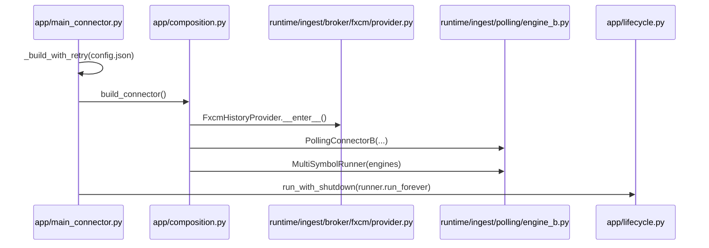
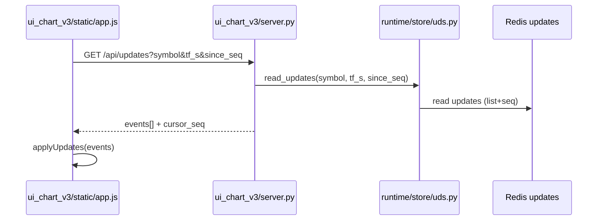
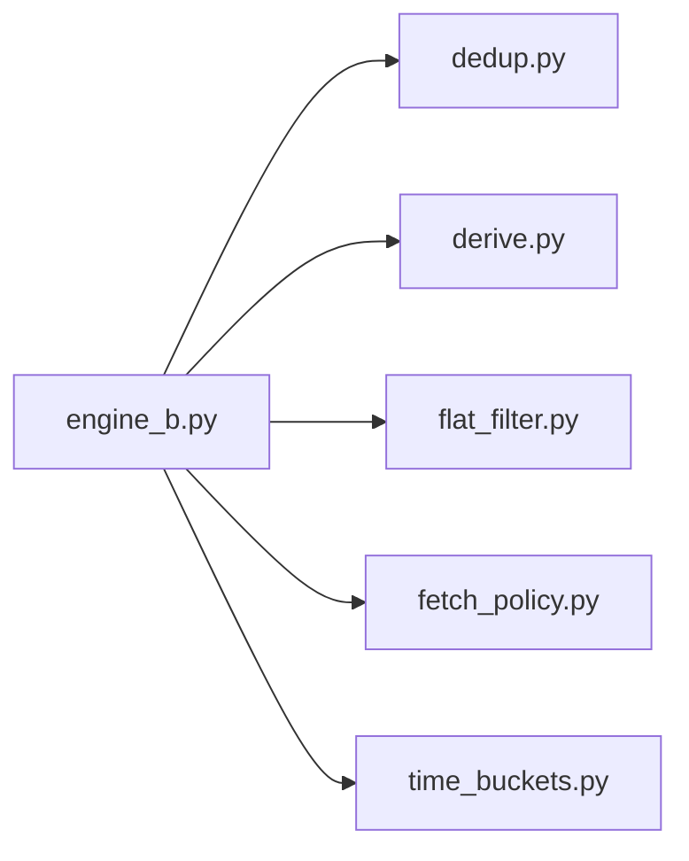

# Поточна система (M5-only)

Цей файл описує актуальний стан системи після спрощення до M5-only.

## Короткий опис

Система працює тільки з M5 як базовим потоком. На старті робиться warmup останніх M5 (history), далі щохвилини підтягування M5 tail (history). Похідні TF (>= 15m) будуються тільки якщо M5-діапазон повний. Write-path іде через UDS: PollingConnectorB пише final у SSOT і Redis snapshots, а updates публікуються у Redis updates bus. UI отримує дані через HTTP API, де UDS працює як reader: cold-load може йти з Redis snapshots з fallback на диск при малому tail, оновлення (/api/updates) читаються з Redis updates bus (disk тільки recovery при redis_down). Preview-plane для 1m/3m повністю wired: FXCM tick publisher (Plane A) → Redis pub/sub → TickPreviewWorker → TickAggregator → UDS.publish_preview_bar → Redis preview keyspace (Plane B). Tick-и валідуються schema guard (tick_v1) на вході TickPreviewWorker. Preview ніколи не пишеться у SSOT JSONL. /api/bars для preview TF завжди йде через read_preview_window (prefer_redis/force_disk ігноруються з loud warning). 0-ticks silence > 120с генерує WARNING. Wallclock fallback для tick_ts позначається src=fxcm_wallclock. P2X.6-U1: для TF≥M5 UI отримує ephemeral overlay бар через /api/overlay (read-only endpoint, агрегує preview M1 в один бар target TF, src=overlay_preview, complete=False, volume=0). Overlay polling кожні 1с, окрема серія в chart, не проходить через applyUpdates/final. UI клієнт абортує застарілі load-запити та ігнорує пізні відповіді. Scrollback працює як cover-until-satisfied: тригер лівого буфера ~2000 барів, підкидає по 5000 (фаворити x2) і повторює догрузку до покриття. UI API читає config.json з кешем mtime (для ui_debug/tf_allowlist/min_coldload_bars). Конфіг шлях визначається через єдиний SSOT модуль `core/config_loader.py` (pick_config_path → AI_ONE_CONFIG_PATH або config.json). ENV використовується тільки для секретів. UI має portable `ui_config.json` + query string `?api_base=` override.

## Геометрія часу (помітка для всіх розмов про свічки)

- SSOT JSONL (CandleBar) тримає end-excl: `close_time_ms = open_time_ms + tf_s*1000`.
- Зовнішній контракт (HTTP API + UI) нормалізує до end-incl: `close_time_ms = open_time_ms + tf_s*1000 - 1`.
- `event_ts`/`event_ts_ms` додається лише у вихідних payload-ах для `complete=true`, не зберігається у SSOT.

Це рішення закріплено історично, щоб не ламати SSOT та уникати «дір» у даних. Будь-які зміни геометрії часу мають проходити через окремий initiative з міграцією і rollback.

## Схема (потік даних)

```mermaid
flowchart LR
    FXCM[(FXCM History API)] -->|history fetch| P[PollingConnectorB]
    P -->|commit_final_bar| U[UDS (writer)]
    U -->|SSOT write| D[(data_v3)]
    U -->|redis snapshots| R[(Redis snapshots)]
    U -->|updates bus| RU[(Redis updates)]
    T[(FXCM Tick Stream)] -->|pub/sub| TP[TickPublisher]
    TP -->|Redis channel| TW[TickPreviewWorker]
    TW -->|schema guard + agg| TA[TickAggregator]
    TA -->|publish_preview_bar| U
    U -->|preview curr/tail/updates| RP[(Redis preview)]
    UI[ui_chart_v3] -->|/api/bars, /api/updates| UR[UDS (reader)]
    UI -->|/api/overlay TF≥M5| UR
    UR -->|cold-load /api/bars| R
    UR -->|/api/bars fallback| D
    UR -->|/api/updates| RU
    D -->|manual rebuild| Rb[tools/rebuild_derived.py]
    P --> M[dedup/derive/flat_filter/fetch_policy]
    M --> P
```

## Схеми процесів і циклів

### Старт і ініціалізація (процес)



### Polling цикл (M5 + derived)

```mermaid
flowchart TD
    A[sleep_to_next_minute] --> B[log calendar state changes]
    B --> C{broker_base_fetch_on_close?}
    C -->|yes| D[fetch_last_n_tf tf=14400/86400]
    C -->|no| E[skip base TF]
    D --> F[fetch_last_n_tf tf=300 (tail)]
    E --> F
    F --> G[ingest M5 (dedup module)]
    G --> H{calendar pause?}
    H -->|trading + flat| Skip[skip flat bar]
    H -->|pause + flat| Accept_PF[accept + ext:calendar_pause_flat]
    H -->|pause + non-flat| Anomaly[WARN anomaly + accept]
    H -->|trading + non-flat| I[derive 15m/30m/1h (derive module)]
    Accept_PF --> I
    Anomaly --> I
    I --> J[commit_final_bar через UDS]
```

### Retry/backoff + календарний сон

```mermaid
flowchart TD
    A[build_connector] -->|ok| B[run_forever]
    A -->|error| C[backoff = base * 2^n]
    C --> D{ORA-499?}
    D -->|yes| E[calendar sleep до open - wake_ahead]
    D -->|no| F[time.sleep(backoff)]
    E --> A
    F --> A
```

### Supervisor stdio (pipe/files/inherit/null)

```mermaid
flowchart TD
    A[app/main.py] --> B{stdio}
    B -->|pipe| C[stdout/stderr -> prefix pump]
    B -->|files| D[logs/<role>.out.log + .err.log]
    B -->|inherit| E[stdout/stderr успадковано]
    B -->|null| F[DEVNULL]
    A --> G{new-console?}
    G -->|yes (Windows)| H[CREATE_NEW_CONSOLE]
    G -->|no| I[default console]
```

### UI polling /api/updates



### UI scrollback (cover-until-satisfied)

- Тригер: дефіцит лівого буфера (~2000 барів).
- Пачки: 5000 барів (фаворити x2).
- Ліміти: active 60000 (фаворити 120000), warm LRU=6 по 20000.

### Модулі polling (залежності)



## Annotated tree (ASCII, розширений)

```text
v3/
|-- app/                         # запуск і складання runtime
|   |-- main.py                  # supervisor (modes + stdio)
|   |-- main_connector.py        # retry/backoff + calendar sleep
|   |-- composition.py           # build_connector, валідація config.json
|   |-- lifecycle.py             # run_with_shutdown + cleanup
|   `-- __init__.py
|-- core/                        # pure-логіка (час, контракти, моделі)
|   |-- model/
|   |   `-- bars.py              # CandleBar + інваріанти часу
|   |-- time_geom.py             # геометрія часу, end-incl
|   `-- buckets.py               # bucket-утиліти
|-- runtime/                     # ingest, store, I/O
|   |-- ingest/                  # FXCM + календар + polling
|   |   |-- broker/
|   |   |   `-- fxcm/
|   |   |       `-- provider.py  # history API
|   |   |-- market_calendar.py   # календар (single-break)
|   |   |-- tick_agg.py           # TickAggregator (preview-plane, tf=60/180)
|   |   |-- tick_preview_worker.py # TickPreviewWorker (Plane A→B, schema guard, 0-ticks loud)
|   |   |-- tick_publisher_fxcm.py # FXCM tick publisher (Plane A, wallclock loud fallback)
|   |   `-- polling/
|   |       |-- engine_b.py      # оркестрація polling циклу
|   |       |-- dedup.py         # індекси дня, has/mark on-disk
|   |       |-- derive.py        # M5Buffer + derive_from_m5
|   |       |-- flat_filter.py   # фільтр плоских барів
|   |       |-- fetch_policy.py  # політики часу для fetch
|   |       `-- time_buckets.py  # floor_bucket_start_ms
|   `-- store/
|       |-- uds.py               # UnifiedDataStore (read/write, updates bus, preview-plane)
|       |-- redis_snapshot.py    # Redis snapshots writer (використовується UDS)
|       |-- redis_keys.py        # нормалізація ключів Redis
|       |-- ssot_jsonl.py        # JSONL SSOT helpers (legacy, не для ingest)
|       `-- layers/
|           |-- ram_layer.py     # RAM LRU шар
|           |-- redis_layer.py   # Redis read шар
|           `-- disk_layer.py    # Disk read шар
|-- ui_chart_v3/                 # UI + API same-origin
|   |-- server.py                # /api/bars, /api/updates, /api/overlay, /api/config
|   |-- __main__.py              # python -m ui_chart_v3
|   `-- static/
|       |-- index.html           # UI shell
|       |-- app.js               # polling + applyUpdates
|       `-- chart_adapter_lite.js# адаптер Lightweight Charts
|-- tools/                       # локальні утиліти
|   |-- fetch_m5_isolated.py      # ізольований M5 fetch
|   |-- rebuild_derived.py        # rebuild derived з M5
|   |-- rebuild_m15_isolated.py   # ізольований rebuild 15m
|   |-- purge_broken_bars.py      # чистка пошкоджених JSONL
|   |-- run_exit_gates.py         # runner exit-gates з manifest.json
|   |-- exit_gates/
|   |   |-- manifest.json         # реєстр усіх gates (14 записів)
|   |   `-- gates/
|   |       |-- gate_config_singleton.py  # P2X.8-C1/C2: 8 sub-gates (DRY config, no split-brain, no dispatcher)
|   |       |-- gate_preview_plane.py  # P2X.6-G1: 4 sub-gates (nomix_disk, uds_hotpath, api_splitbrain, tick_schema)
|   |       |-- gate_preview_not_on_disk.py  # preview не на диску (data scan)
|   |       `-- gate_no_preview_in_final_redis.py  # preview не у final Redis
|   `-- __init__.py
|-- core/
|   |-- config_loader.py         # SSOT: pick_config_path / resolve_config_path / env_str / load_system_config
|   |-- buckets.py               # bucket_start_ms / resolve_anchor_offset_ms
|   `-- time_geom.py             # normalize_bar
|-- config.json                  # SSOT конфіг (один файл, без profile branching)
|-- env_profile.py               # завантаження .env → секрети (load_env_secrets)
|-- .env                         # тільки секрети (FXCM credentials). Канали/Redis — config.json
|-- ui_chart_v3/
|   |-- static/
|   |   |-- app.js               # клієнт (API_BASE + ?api_base= override)
|   |   `-- ui_config.json       # portable UI конфіг (api_base, ui_debug)
|   `-- server.py                # HTTP API + static server
|-- data_v3/                     # SSOT дані (JSONL)
|-- changelog.jsonl              # детальний журнал
|-- CHANGELOG.md                 # короткий індекс
|-- docs/
|   |-- system_current_overview.md   # цей файл
|   `-- redis_snapshot_design.md     # дизайн Redis snapshots
```

## Ключові можливості

- M5-only ingest: warmup + live tail з history.
- Derived TF: 15m/30m/1h з M5, тільки при повному діапазоні M5.
- Base TF (H4/D1): broker fetch на закритті бакета.
- UI: HTTP API /api/bars, /api/updates, /api/config (same-origin), cold-load з Redis snapshots.
- UDS: writer у polling, reader у UI; /api/updates читає Redis updates bus.
- Preview-plane: Plane A (FXCM tick pub/sub) → Plane B (TickPreviewWorker + TickAggregator → UDS preview keyspace). Schema guard tick_v1 на вході. NoMix guard у UDS. 0-ticks loud. /api/bars для preview TF завжди через read_preview_window (prefer_redis/force_disk ігноруються).
- Write-path: PollingConnectorB пише через UDS (SSOT + Redis snapshots + updates bus).
- Supervisor: режими stdio pipe/files/inherit/null + префікси логів.
- Ручний rebuild: tools/rebuild_derived.py з M5 SSOT.
- Derived tail rebuild: опційно при старті з M5 tail під бюджет, ok-state у _derived_tail_state.json.
- Календарі: групи з однією daily break парою (UTC) через config.json.
- Polling логіка модульна: dedup/derive/flat_filter/fetch_policy в окремих файлах.

## Масштабування (дизайн)

Окремий документ: [redis_snapshot_design.md](redis_snapshot_design.md).

## Ланцюжки дій

### 1) Старт системи

1. Bootstrap: читаємо останній M5 з диску.
2. Warmup M5 tail: `warmup_bars` останніх M5 з history.
3. Запис у SSOT JSONL, dedup на рівні open_time_ms.
4. UI може запитати /api/bars і отримати історію з диску.

### 2) Live цикл (poll)

1. Кожну хвилину: fetch_last_n_tf(M5, n=12) до останнього закритого M5.
2. Запис нових барів у SSOT (dedup + allow_older).
3. Для кожного нового M5: спроба derived (15m/30m/1h) при повному M5-діапазоні.
4. UI отримує оновлення через /api/updates.

### 3) Base TF (H4/D1)

1. На закритті бакета (торгова хвилина): fetch_last_n_tf(tf, n=1).
2. Якщо open_time збігається з очікуваним b0, бар дописується у SSOT.

### 4) Ручний rebuild derived

1. tools/rebuild_derived.py читає M5 JSONL.
2. Агрегує у TF > 300, кратні 300.
3. Записує тільки відсутні бари (dedup по open_time_ms).

## Примітки

- Warmup і tail роблять API history-запити і витрачають ліміт FXCM.
- Derived пропускаються при будь-якій дірці у M5 в межах бакета.
- Календар (break/weekend) впливає на очікування торгових хвилин у runtime.
- UI cold-load з Redis snapshots (якщо є), fallback на SSOT JSONL; /api/updates читає з Redis updates bus.
