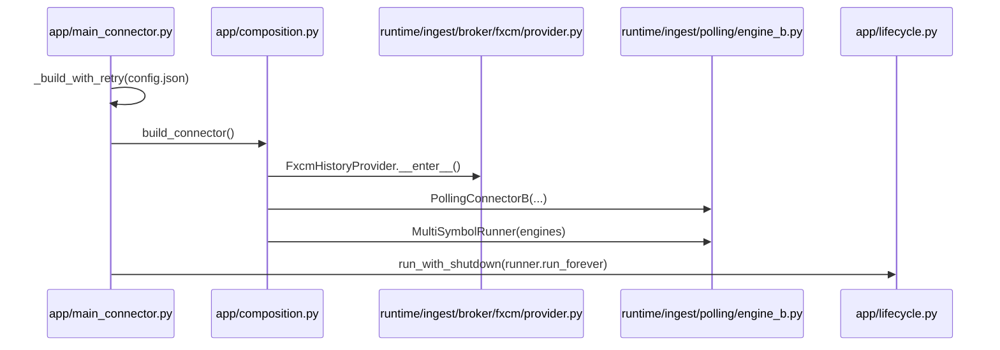
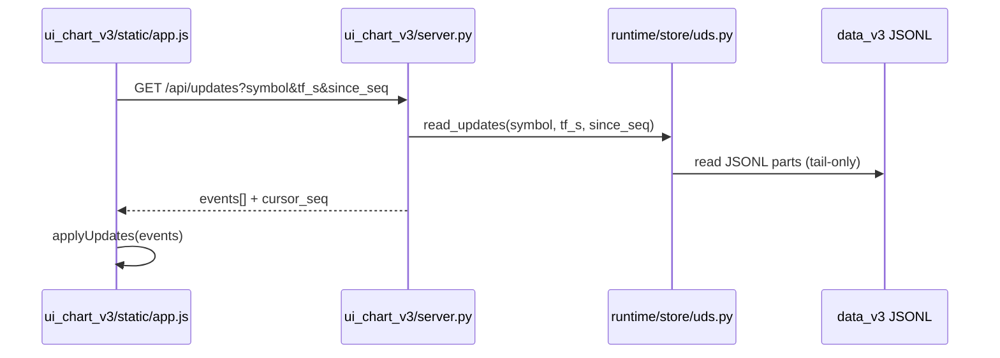
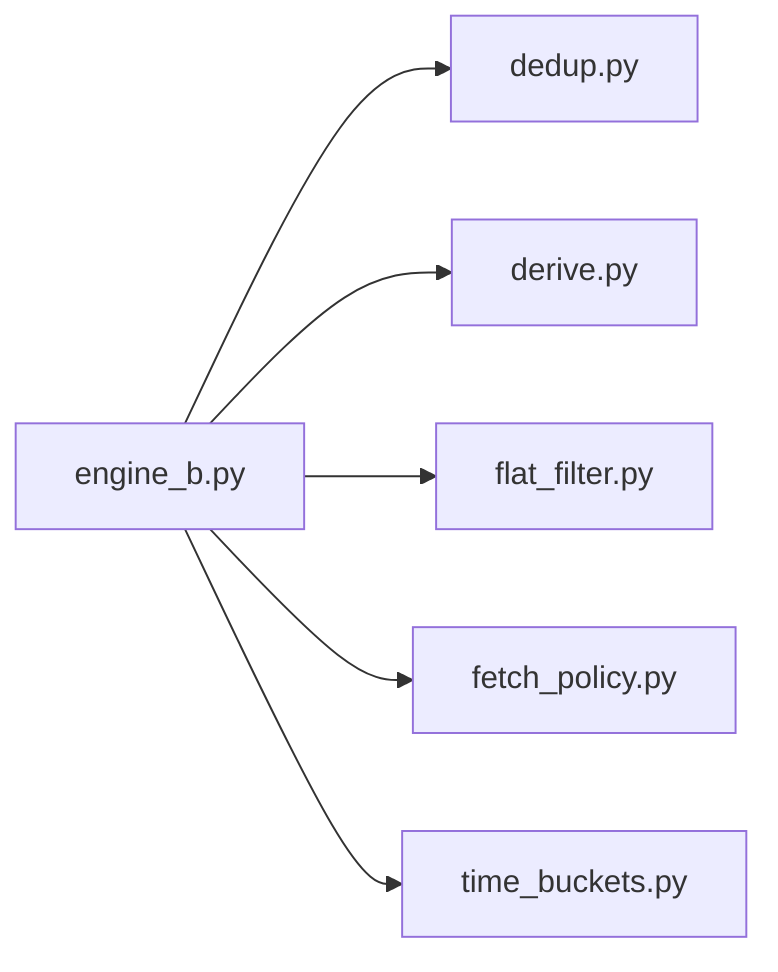

# Поточна система (M5-only)

Цей файл описує актуальний стан системи після спрощення до M5-only.

## Короткий опис

Система працює тільки з M5 як базовим потоком. На старті робиться warmup останніх M5 (history), далі щохвилини підтягування M5 tail (history). Похідні TF (>= 15m) будуються тільки якщо M5-діапазон повний. UI отримує дані через HTTP API, де UDS працює як read-only: cold-load може йти з Redis snapshots з fallback на диск при малому tail, оновлення (/api/updates) читаються з SSOT JSONL через tail-only scan. Write-path поки що обходить UDS (PollingConnectorB пише JSONL/Redis напряму). UI клієнт абортує застарілі load-запити та ігнорує пізні відповіді. Scrollback працює як cover-until-satisfied: тригер лівого буфера ~2000 барів, підкидає по 5000 (фаворити x2) і повторює догрузку до покриття. UI API читає config.json з кешем mtime (для ui_debug/tf_allowlist/min_coldload_bars). Профіль середовища визначається через `.env` -> `.env.local/.env.prod`, а Redis host/port/db/ns береться з FXCM_REDIS_* (env override).

## Геометрія часу (помітка для всіх розмов про свічки)

- SSOT JSONL (CandleBar) тримає end-excl: `close_time_ms = open_time_ms + tf_s*1000`.
- Зовнішній контракт (HTTP API + UI) нормалізує до end-incl: `close_time_ms = open_time_ms + tf_s*1000 - 1`.
- `event_ts`/`event_ts_ms` додається лише у вихідних payload-ах для `complete=true`, не зберігається у SSOT.

Це рішення закріплено історично, щоб не ламати SSOT та уникати «дір» у даних. Будь-які зміни геометрії часу мають проходити через окремий initiative з міграцією і rollback.

## Схема (потік даних)

```mermaid
flowchart LR
    FXCM[(FXCM History API)] -->|history fetch| P[PollingConnectorB]
    P -->|dedup + flat_filter| D[(data_v3)]
    P -->|derive from M5| D
    P -->|redis snapshots| R[(Redis snapshots)]
    UI[ui_chart_v3] -->|/api/bars, /api/updates| U[UDS (read-only)]
    U -->|cold-load /api/bars| R
    U -->|/api/bars fallback| D
    U -->|/api/updates tail-only| D
    D -->|manual rebuild| Rb[tools/rebuild_derived.py]
    P --> M[dedup/derive/flat_filter/fetch_policy]
    M --> P
```

## Схеми процесів і циклів

### Старт і ініціалізація (процес)



### Polling цикл (M5 + derived)

```mermaid
flowchart TD
    A[sleep_to_next_minute] --> B[log calendar state changes]
    B --> C{broker_base_fetch_on_close?}
    C -->|yes| D[fetch_last_n_tf tf=14400/86400]
    C -->|no| E[skip base TF]
    D --> F[fetch_last_n_tf tf=300 (tail)]
    E --> F
    F --> G[ingest M5 (dedup module)]
    G --> H[filter flat bars (flat_filter)]
    H --> I[derive 15m/30m/1h (derive module)]
    I --> J[append JSONL SSOT]
```

### Retry/backoff + календарний сон

```mermaid
flowchart TD
    A[build_connector] -->|ok| B[run_forever]
    A -->|error| C[backoff = base * 2^n]
    C --> D{ORA-499?}
    D -->|yes| E[calendar sleep до open - wake_ahead]
    D -->|no| F[time.sleep(backoff)]
    E --> A
    F --> A
```

### Supervisor stdio (pipe/files/inherit/null)

```mermaid
flowchart TD
    A[app/main.py] --> B{stdio}
    B -->|pipe| C[stdout/stderr -> prefix pump]
    B -->|files| D[logs/<role>.out.log + .err.log]
    B -->|inherit| E[stdout/stderr успадковано]
    B -->|null| F[DEVNULL]
    A --> G{new-console?}
    G -->|yes (Windows)| H[CREATE_NEW_CONSOLE]
    G -->|no| I[default console]
```

### UI polling /api/updates



### UI scrollback (cover-until-satisfied)

- Тригер: дефіцит лівого буфера (~2000 барів).
- Пачки: 5000 барів (фаворити x2).
- Ліміти: active 60000 (фаворити 120000), warm LRU=6 по 20000.

### Модулі polling (залежності)



## Annotated tree (ASCII, розширений)

```text
v3/
|-- app/                         # запуск і складання runtime
|   |-- main.py                  # supervisor (modes + stdio)
|   |-- main_connector.py        # retry/backoff + calendar sleep
|   |-- composition.py           # build_connector, валідація config.json
|   |-- lifecycle.py             # run_with_shutdown + cleanup
|   `-- __init__.py
|-- core/                        # pure-логіка (час, контракти, моделі)
|   |-- model/
|   |   `-- bars.py              # CandleBar + інваріанти часу
|   |-- time_geom.py             # геометрія часу, end-incl
|   `-- buckets.py               # bucket-утиліти
|-- runtime/                     # ingest, store, I/O
|   |-- ingest/                  # FXCM + календар + polling
|   |   |-- broker/
|   |   |   `-- fxcm/
|   |   |       `-- provider.py  # history API
|   |   |-- market_calendar.py   # календар (single-break)
|   |   `-- polling/
|   |       |-- engine_b.py      # оркестрація polling циклу
|   |       |-- dedup.py         # індекси дня, has/mark on-disk
|   |       |-- derive.py        # M5Buffer + derive_from_m5
|   |       |-- flat_filter.py   # фільтр плоских барів
|   |       |-- fetch_policy.py  # політики часу для fetch
|   |       `-- time_buckets.py  # floor_bucket_start_ms
|   `-- store/
|       |-- uds.py               # UnifiedDataStore (read-only у UI)
|       |-- redis_snapshot.py    # Redis snapshots writer
|       |-- redis_keys.py        # нормалізація ключів Redis
|       |-- ssot_jsonl.py        # JSONL SSOT writer/reader helpers
|       `-- layers/
|           |-- ram_layer.py     # RAM LRU шар
|           |-- redis_layer.py   # Redis read шар
|           `-- disk_layer.py    # Disk read шар
|-- ui_chart_v3/                 # UI + API same-origin
|   |-- server.py                # /api/bars, /api/updates, /api/config
|   |-- __main__.py              # python -m ui_chart_v3
|   `-- static/
|       |-- index.html           # UI shell
|       |-- app.js               # polling + applyUpdates
|       `-- chart_adapter_lite.js# адаптер Lightweight Charts
|-- tools/                       # локальні утиліти
|   |-- fetch_m5_isolated.py      # ізольований M5 fetch
|   |-- rebuild_derived.py        # rebuild derived з M5
|   |-- rebuild_m15_isolated.py   # ізольований rebuild 15m
|   |-- purge_broken_bars.py      # чистка пошкоджених JSONL
|   `-- __init__.py
|-- config.json                  # SSOT конфіг (календарі груп)
|-- env_profile.py               # завантаження .env профілів
|-- .env                         # dispatcher (AI_ONE_ENV_FILE)
|-- .env.local                   # локальні FXCM/Redis параметри (секрети)
|-- .env.prod                    # прод FXCM/Redis параметри (секрети)
|-- data_v3/                     # SSOT дані (JSONL)
|-- changelog.jsonl              # детальний журнал
|-- CHANGELOG.md                 # короткий індекс
|-- docs/
|   |-- system_current_overview.md   # цей файл
|   `-- redis_snapshot_design.md     # дизайн Redis snapshots
```

## Ключові можливості

- M5-only ingest: warmup + live tail з history.
- Derived TF: 15m/30m/1h з M5, тільки при повному діапазоні M5.
- Base TF (H4/D1): broker fetch на закритті бакета.
- UI: HTTP API /api/bars, /api/updates, /api/config (same-origin), cold-load з Redis snapshots.
- UDS: read-only у UI, /api/updates читає disk tail.
- Write-path: PollingConnectorB пише JSONL/Redis напряму (UDS write-center у плані P2X).
- Supervisor: режими stdio pipe/files/inherit/null + префікси логів.
- Ручний rebuild: tools/rebuild_derived.py з M5 SSOT.
- Derived tail rebuild: опційно при старті з M5 tail під бюджет, ok-state у _derived_tail_state.json.
- Календарі: групи з однією daily break парою (UTC) через config.json.
- Polling логіка модульна: dedup/derive/flat_filter/fetch_policy в окремих файлах.

## Масштабування (дизайн)

Окремий документ: [redis_snapshot_design.md](redis_snapshot_design.md).

## Ланцюжки дій

### 1) Старт системи

1. Bootstrap: читаємо останній M5 з диску.
2. Warmup M5 tail: `warmup_bars` останніх M5 з history.
3. Запис у SSOT JSONL, dedup на рівні open_time_ms.
4. UI може запитати /api/bars і отримати історію з диску.

### 2) Live цикл (poll)

1. Кожну хвилину: fetch_last_n_tf(M5, n=12) до останнього закритого M5.
2. Запис нових барів у SSOT (dedup + allow_older).
3. Для кожного нового M5: спроба derived (15m/30m/1h) при повному M5-діапазоні.
4. UI отримує оновлення через /api/updates.

### 3) Base TF (H4/D1)

1. На закритті бакета (торгова хвилина): fetch_last_n_tf(tf, n=1).
2. Якщо open_time збігається з очікуваним b0, бар дописується у SSOT.

### 4) Ручний rebuild derived

1. tools/rebuild_derived.py читає M5 JSONL.
2. Агрегує у TF > 300, кратні 300.
3. Записує тільки відсутні бари (dedup по open_time_ms).

## Примітки

- Warmup і tail роблять API history-запити і витрачають ліміт FXCM.
- Derived пропускаються при будь-якій дірці у M5 в межах бакета.
- Календар (break/weekend) впливає на очікування торгових хвилин у runtime.
- UI cold-load з Redis snapshots (якщо є), fallback на SSOT JSONL; /api/updates читає з диску.
