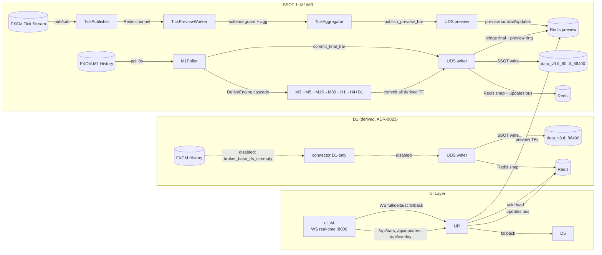
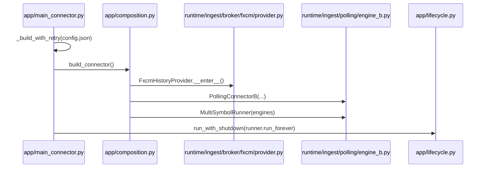
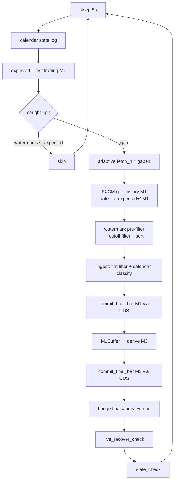
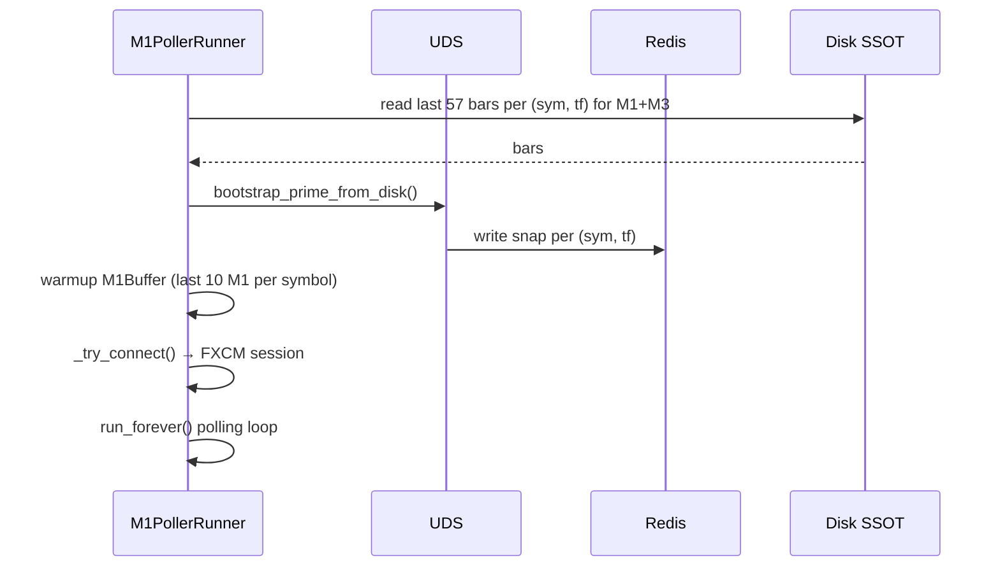
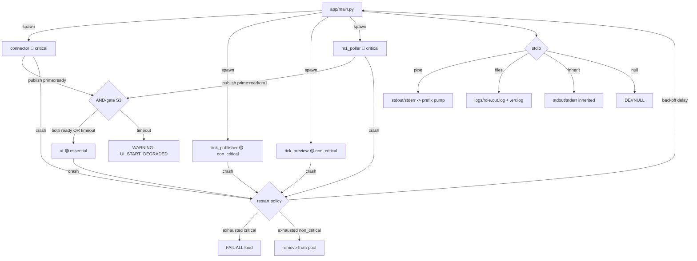
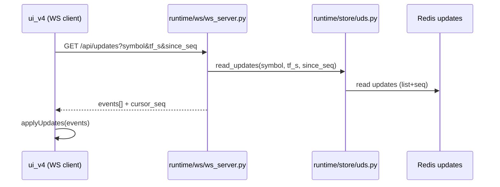
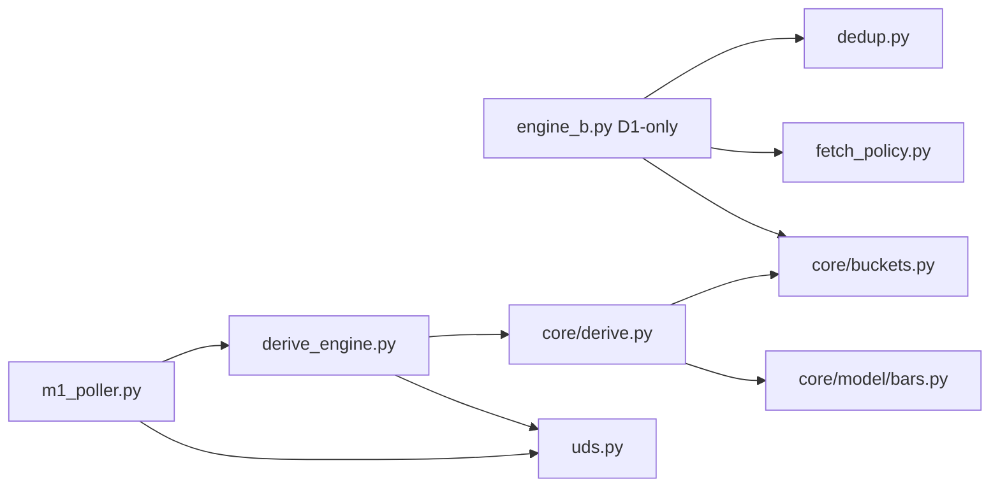
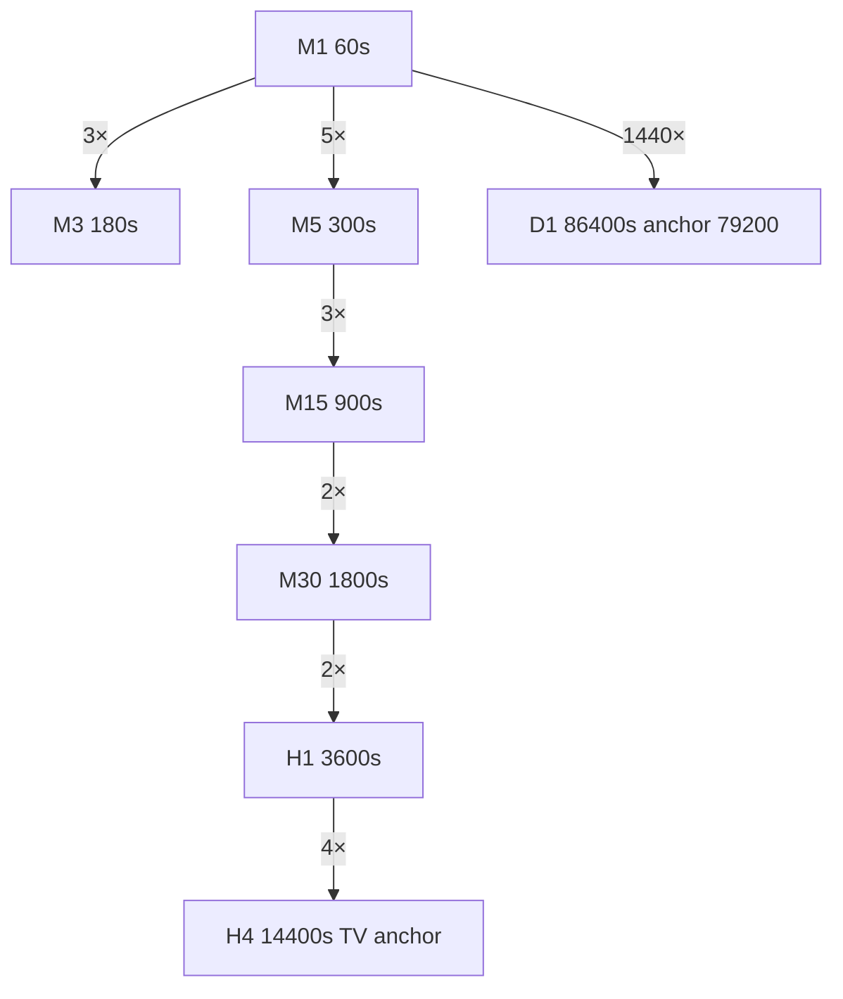

# Поточна система — Архітектурний огляд (SSOT)

> **Останнє оновлення**: 2026-03-24
> **Навігація**: [docs/index.md](index.md)

Цей файл — SSOT-опис поточної архітектури системи. Див. [docs/index.md](index.md) для навігації по всій документації.

---

## Зміст

1. [Короткий опис](#короткий-опис)
2. [Архітектура процесів](#архітектура-процесів)
3. SSOT-площини
4. [Dependency Rule / Boundary](#dependency-rule--boundary)
5. [SSOT: де що живе](#ssot-де-що-живе)
6. [Геометрія часу](#геометрія-часу-помітка-для-всіх-розмов-про-свічки)
7. [Інваріанти (I0–I6)](#інваріанти-i0i6)
8. [Схема (потік даних)](#схема-потік-даних)
9. [UI Render Pipeline](#ui-render-pipeline--повний-потік-даних-актуально)
10. [Annotated tree](#annotated-tree-ascii-актуальний)
11. [Stop-rules та режими](#stop-rules-та-режими)

---

## Короткий опис

Система має **два SSOT-потоки**:

- **M1→H4+D1 derive chain (основний)** — M1 final bars з FXCM History API
    (`m1_poller`) → DeriveEngine cascade:
    `M3(3×M1)→M5(5×M1)→M15(3×M5)→M30(2×M15)→H1(2×M30)→H4(4×H1)+D1(1440×M1)`.
    Всі TF від M1 до D1 деривуються з одного джерела. Preview-plane: tick stream
    → TickPreviewWorker → Redis preview keyspace.
- **D1 (derived, ADR-0023)** — глобальний тренд. D1 = `1440 × M1`, anchor
    `79200s` (22:00 UTC). DeriveEngine будує D1 як derived TF; engine_b D1 broker
    fetch вимкнено (`broker_base_tfs_s: []`).

Supervisor (`app.main --mode all`) керує 6 процесами. UDS є центром
читання/запису: writer-и пишуть через UDS (SSOT disk + Redis snapshots +
updates bus), UI читає через UDS. Preview-plane (M1/M3) живе в Redis keyspace,
final-и з M1 poller проходять bridge до preview ring (final>preview).
`ui_stitching_enabled` = false за замовчуванням — показуємо реальні гепи (TV-like);
SSOT на диску не модифікується.

> **ADR-0002 завершено**: engine_b M5 polling вимкнено (m5_polling_enabled=false), derived_tfs_s=[]. Всі TF M1→H4 через m1_poller/DeriveEngine.  
> **ADR-0023 (D1 derive)**: D1 стає derived TF (1440×M1, anchor 79200). engine_b broker_base_tfs_s=[] — D1 fetch з broker вимкнено.

## Архітектура процесів

```text
app.main (supervisor)
  ├── connector             (engine_b; broker_base_tfs_s=[] — D1 fetch OFF, ADR-0023)
  ├── tick_publisher_fxcm   (ForexConnect tick stream → Redis PubSub, .venv37/)
  ├── tick_preview_worker   (Redis PubSub → UDS preview M1/M3)
  ├── broker_sidecar        (ADR-0016: stateless FXCM M1 fetcher, .venv37/, Redis IPC)
  ├── m1_ingestion_worker   (ADR-0016: BrokerRedisProxy → UDS final M1 + DeriveEngine cascade, .venv/)
  ├── m1_poller             (legacy single-process mode: FXCM M1 History → UDS, fallback якщо .venv37/ відсутній)
  └── ws_server             (WS server, port 8000 — ui_v4 real-time + HTTP API)
                              ├── SmcRunner (in-process, ADR-0024): SmcEngine per (symbol, tf) → zones/swings/levels in WS frames
                              └── Drawing tools: 4 tools (H/T/R/E), glass toolbar, theme-aware (ADR-0007, ADR-0008)
```

> **Dual-venv (ADR-0016)**: Supervisor автоматично використовує `.venv37/` (Python 3.7) для
> broker_sidecar та tick_publisher_fxcm, і `.venv/` (Python ≥3.11) для всього іншого.
> Якщо `.venv37/` не знайдено — fallback на legacy m1_poller (single-process, Python 3.7).
> На Windows supervisor завершує workers через tree-kill (`taskkill /T`) і тримає `logs/supervisor.pid`,
> бо Python 3.14 venv launcher створює trampoline-процес перед реальним worker.

```

## SSOT-площини ізольовані (SSOT)

```text
┌──────────────────────────────────────────────────────────────┐
│  SSOT-1: M1/M3 (візуальність + точки входу)                  │
│  Джерело: tick stream → preview, FXCM M1 History → final     │
│  Disk: data_v3/{sym}/tf_60/ та tf_180/                       │
│  Процеси: m1_poller (final), tick_publisher+preview_worker   │
│  Ізоляція: НЕ впливає на M5+ pipeline                        │
├──────────────────────────────────────────────────────────────┤
│  SSOT-2: M5→H4+D1 (derived від M1, SMC аналітика)              │
│  Джерело: DeriveEngine cascade з M1 (m1_poller)              │
│  M5=5×M1, M15=3×M5, M30=2×M15, H1=2×M30, H4=4×H1          │
│  D1=1440×M1 (anchor 79200, ADR-0023)                         │
│  Disk: data_v3/{sym}/tf_300..tf_86400/                       │
│  Процес: m1_poller + DeriveEngine                            │
│  engine_b M5 polling OFF (ADR-0002 Phase 5)                  │
│  engine_b D1 fetch OFF (ADR-0023, broker_base_tfs_s=[])      │
├──────────────────────────────────────────────────────────────┤
│  SSOT-3: D1 (legacy broker, декомісіоновано)                  │
│  engine_b broker_base_tfs_s: [] (ADR-0023)                   │
│  Старі D1 бари на диску зберігаються (не перебудовуються)   │
├──────────────────────────────────────────────────────────────┤
│  SMC Overlay (ephemeral, ADR-0024)                            │
│  SmcEngine (core/smc/): pure SMC detection — read-only,       │
│    NOT SSOT, NOT persisted on disk                             │
│  SmcRunner (runtime/smc/): lives in ws_server process,        │
│    warmup via UDS.read_window(), on_bar() callback             │
│  Алгоритми: Swings, BOS/CHoCH, OB, FVG, Liquidity,           │
│    Premium/Discount, Inducement + N1 zone lifecycle            │
│  TDA Cascade (ADR-0040): D1→H4→Session→M15 FVG daily signal   │
│    core/smc/tda/ (pure) + runtime/smc/tda_live.py (I/O)       │
│    Config F trade mgmt, grade system, 1 signal/day max         │
│    Fallback: smc.signals (ADR-0039) when tda_cascade.enabled=false │
│  Transport: вбудований у WS full/delta frames (zones,         │
│    swings, levels, smc_delta, signals, pd_state) — NO Redis   │
│  819 tests, E1+S4+E2+N1/N2/N3+D1-D3+ADR-0024a+ADR-0040+ADR-0041 │
└──────────────────────────────────────────────────────────────┘
```

## Геометрія часу (помітка для всіх розмов про свічки)

**Dual convention (канон):**

| Шар | Поле | Семантика | Формула |
|---|---|---|---|
| CandleBar / SSOT JSONL / HTTP API | `close_time_ms` | **end-excl** | `open_time_ms + tf_s * 1000` |
| Redis (ohlcv / preview:curr / preview:tail) | `close_ms` | **end-incl** | `open_ms + tf_s * 1000 - 1` |

- Конвертація end-excl → end-incl відбувається **тільки** на межі Redis write:
  `redis_snapshot._bar_to_cache_bar`, `redis_snapshot.put_bar`, `uds.publish_preview_bar`.
- При читанні з Redis, UDS перераховує `close_ms = open_ms + tf_s*1000` (end-excl, ігноруючи stored close_ms).
- `event_ts`/`event_ts_ms` додається лише у вихідних payload-ах для `complete=true`, не зберігається у SSOT.

Це рішення є каноном. Будь-які зміни геометрії часу мають проходити через окремий initiative з міграцією і rollback.

## Dependency Rule / Boundary

Шари системи мають строгу ієрархію залежностей:

```text
┌─────────────────────────────────────────────────────────────┐
│  core/        pure-логіка (час, контракти, моделі)          │
│               НЕ імпортує: runtime/, ui/, tools/            │
│               НЕ має I/O: файли, мережа, Redis, FXCM       │
├─────────────────────────────────────────────────────────────┤
│  runtime/     I/O та процеси (ingest, store, pub/sub)       │
│               Імпортує: core/                               │
│               НЕ імпортує: tools/, ui/                      │
├─────────────────────────────────────────────────────────────┤
│  ui_v4/      презентація (Svelte 5 + LWC 5, same-origin :8000)  │
│               Імпортує: нічого (чистий frontend)               │
│               НЕ містить доменної логіки                    │
├─────────────────────────────────────────────────────────────┤
│  app/         запуск, supervisor, lifecycle                  │
│               Імпортує: core/, runtime/ (для build/start)   │
├─────────────────────────────────────────────────────────────┤
│  tools/       одноразові утиліти/діагностика/міграції       │
│               Імпортує: core/ (дозволено)                   │
│               НЕ імпортується з runtime/ui/app              │
└─────────────────────────────────────────────────────────────┘
```

**Enforcement**: `tools/exit_gates/gates/` містить gate для перевірки dependency rule (AST).

## SSOT: де що живе

| Що | Де (файл/модуль) | Примітки |
| --- | --- | --- |
| **Контракти** (JSON Schema) | `core/contracts/public/marketdata_v1/` | bar_v1, window_v1, updates_v1, tick_v1 |
| **Конфіг** (policy SSOT) | `config.json` (довідник: [config_reference.md](config_reference.md)) | Один файл; .env — лише секрети. Секція `bootstrap` — SSOT для warmup/cold-start параметрів (S4, ADR-0003) |
| **Геометрія часу** | `core/model/bars.py`, `core/buckets.py` | end-excl канон: `close_time_ms = open_time_ms + tf_s*1000`; guard: `assert_invariants()` |
| **Дані** (SSOT JSONL) | `data_v3/{symbol}/tf_{tf_s}/part-YYYYMMDD.jsonl` | append-only, final-only |
| **Redis cache** | `{NS}:ohlcv:snap/tail:{sym}:{tf_s}` | Не SSOT; warmup/cold-load кеш |
| **Preview plane** | `{NS}:preview:*` у Redis | Ізольований keyspace; не на диску |
| **Updates bus** | Redis list `{NS}:updates:{sym}:{tf_s}` + seq | Hot-path для /api/updates |
| **TF allowlist** | `config.json → tf_allowlist_s` | `[60, 180, 300, 900, 1800, 3600, 14400, 86400]` |
| **Preview TF allowlist** | `config.json → preview_tick_tfs_s` | `[60, 180, 300, 900, 1800, 3600, 14400, 86400]` (M1→D1, HTF running accumulator) |
| **Symbols** | `config.json → symbols` | 4 активних (XAU/USD, XAG/USD, BTCUSDT, ETHUSDT) |
| **Day anchors** | `config.json → day_anchor_offset_s*` | H4/D1 bucket alignment |
| **Market calendar** | `config.json → market_calendar_*` | Per-group, single-break, UTC |
| **SMC config** | `config.json → smc` | Алгоритми, cap-и, performance (ADR-0024). Ephemeral overlay, не на диску |
| **SMC types** | `core/smc/types.py` | SmcZone/SmcSwing/SmcLevel/SmcSnapshot/SmcDelta |
| **SMC wire** | `ui_v4/src/types.ts` | SmcData/SmcDeltaWire — contract з backend |
| **TDA Cascade config** | `config.json → smc.tda_cascade` | 4-stage daily signal (ADR-0040). `enabled: false` → fallback на ADR-0039 zone-reactive |
| **TDA types** | `core/smc/tda/types.py` | TdaCascadeConfig/TdaSignal/FvgEntry/TradeState |

## Інваріанти (I0–I6)

| ID | Інваріант | Enforcement |
| --- | --- | --- |
| **I0** | **Dependency Rule**: core/ ← runtime/ ← ui/; tools/ ізольовані | Exit-gate AST перевірка |
| **I1** | **UDS як вузька талія**: всі writes через `commit_final_bar`/`publish_preview_bar`; UI = `role="reader"`, `_ensure_writer_role()` кидає `RuntimeError` | Runtime guard у UDS |
| **I2** | **Єдина геометрія часу**: canonical = epoch_ms int. CandleBar/SSOT/API = end-excl (`close_time_ms = open + tf_s*1000`). Redis ALL = end-incl (`close_ms = open + tf_s*1000 - 1`). Конвертація на межі Redis write (`redis_snapshot`, `uds.publish_preview_bar`). | `core/model/bars.py:assert_invariants`, `_ensure_bar_payload_end_excl` |
| **I3** | **Final > Preview (NoMix)**: `complete=true` (final, `source ∈ {history, derived, history_agg}`) завжди перемагає `complete=false` (preview). NoMix guard у UDS | Watermark + NoMix violation tracking |
| **I4** | **Один update-потік для UI**: UI отримує бари лише через `/api/updates` (upsert events) + `/api/bars` (cold-load). Жодних паралельних каналів | Contract-first API schema |
| **I5** | **Degraded-but-loud**: будь-який fallback/перемикання джерел/geom_fix → `warnings[]`/`meta.extensions`, не silent. `bars=[]` завжди з `warnings[]` (no_data rail) | `_contract_guard_warn_*` + no_data branch |
| **I6** | **Stop-rule**: якщо зміна ламає I0–I5 → зупинити PATCH, зробити ADR. Ніяких "одноразових" фіксів без обґрунтування | Governance: copilot-instructions.md rev 2.0 |

> **Disk policy (P11)**: disk не читається для polling/updates. Cold-load/switch =
> `disk_policy="bootstrap"` (тільки 60s після boot). Scrollback =
> `disk_policy="explicit"` (max_steps=6 + cooldown 0.5s). Guard:
> `_disk_allowed()` у UDS; `SCROLLBACK_MAX_STEPS`/`SCROLLBACK_COOLDOWN_S`
> у ws_server.

### UI v4 Frontend Stack (Svelte 5 + LWC 5)

| Компонент | Стан | Файл(и) | ADR |
|---|---|---|---|
| ChartEngine | ✅ v3 parity (volume, D1, tooltip, follow, rAF) | engine.ts | — |
| SMC Overlay | ✅ OB/FVG/Swings/Levels, strength opacity, 4 toggles, double-RAF sync | OverlayRenderer.ts, smcStore.ts | ADR-0024 §18.7 |
| DrawingsRenderer | ✅ 4 tools (hline/trend/rect/eraser), theme-aware | DrawingsRenderer.ts | ADR-0007, ADR-0008 |
| DrawingToolbar | ✅ Glass-like, CSS custom properties, micro-interactions | DrawingToolbar.svelte | ADR-0008 |
| Theming | ✅ 3 themes (dark/black/light) + `applyThemeCssVars()` на `:root` | themes.ts, App.svelte | ADR-0008 |
| ChartHud | ✅ Variant H shell: thesis bar (symbol+price+P/D chip+headline) + tactical strip (stage-driven visibility, bias pills, session, inv, target) + accent bar (READY/TRIGGERED) | ChartHud.svelte, PdBadge.svelte | ADR-0036, ADR-0041 |
| Interaction | ✅ Y-zoom, Y-pan, scroll, keyboard shortcuts | interaction.ts | — |
| DiagPanel | ✅ FE diagnostics, WS state, frame freshness | DiagPanel.svelte | — |
| WSConnection | ✅ Quiet degraded, reconnect backoff | connection.ts | — |

## Stop-rules та режими

### Режими роботи Copilot/розробника

| Режим | Коли | Що дозволено |
| --- | --- | --- |
| **MODE=DISCOVERY** | Аналіз/дослідження | Read-only; кожна теза — з доказом (path:line) |
| **MODE=PATCH** | Мінімальний фікс | ≤150 LOC, ≤1 новий файл, без нових concurrency patterns. Потребує VERIFY + POST |
| **MODE=ADR** | Зміна інваріантів/контрактів/протоколу | ADR документ: проблема → рішення → інваріанти → exit criteria → rollback |

### Stop-rules (зупинись і не «дописуй ще»)

Зупинятись і **не додавати нові фічі**, якщо:

- порушені інваріанти I0–I6
- з'явився split-brain (два паралельні джерела істини для одного UI-стану)
- з'явився silent fallback
- зміна торкається контрактів/даних без плану міграції та rollback
- Copilot починає плодити утиліти/модулі замість правки «вузької талії»

У цих випадках — окремий PATCH, який **лише відновлює інваріант/межу**.

## Схема (потік даних)


```mermaid
flowchart LR
    subgraph SSOT1["SSOT-1: M1/M3"]
        T[(FXCM Tick Stream)] -->|pub/sub| TP[TickPublisher]
        TP -->|Redis channel| TW[TickPreviewWorker]
        TW -->|schema guard + agg| TA[TickAggregator]
        TA -->|publish_preview_bar| U1[UDS preview]
        U1 -->|preview curr/tail/updates| RP[(Redis preview)]
        FXCM1[(FXCM M1 History)] -->|poll 8s| M1P[M1Poller]
        M1P -->|commit_final_bar| U2[UDS writer]
        M1P -->|DeriveEngine cascade| DE[M3→M5→M15→M30→H1→H4+D1]
        DE -->|commit all derived TF| U2
        U2 -->|SSOT write| D1[(data_v3 tf_60..tf_86400)]
        U2 -->|Redis snap + updates bus| R1[(Redis)]
        U2 -->|bridge final→preview ring| RP
    end
    subgraph SSOT3["D1 (derived, ADR-0023)"]
        FXCMH[(FXCM History)] -.->|disabled: broker_base_tfs_s=empty| P[connector D1-only]
        P -.->|disabled| U3[UDS writer]
        U3 -->|SSOT write| DH[(data_v3 tf_86400)]
        U3 -->|Redis snap| R5[(Redis)]
    end
    subgraph UI["UI Layer"]
        UIv4[ui_v4<br/>WS real-time :8000] -->|WS full/delta/scrollback| UR
        UIv4 -->|/api/bars, /api/updates, /api/overlay| UR
        UR -->|cold-load| R5
        UR -->|fallback| D5
        UR -->|preview TFs| RP
        UR -->|updates bus| R5
    end
```

### Схема A: Final OHLCV Pipeline (канонічний потік)

```mermaid
flowchart LR
    subgraph Broker["A: Broker (FXCM)"]
        FX1[(History M1)]
        FXH[(History D1)]
    end
    subgraph Writers["Writers (ingest)"]
        EB[engine_b<br/>D1 fetch OFF]
        M1P[m1_poller<br/>poll 8s]
        DRV[DeriveEngine<br/>M3→M5→M15→M30→H1→H4+D1]
    end
    subgraph UDS["C: UDS (вузька талія)"]
        CFB[commit_final_bar]
        WM{{watermark guard}}
        DSK[(Disk SSOT<br/>data_v3/*.jsonl)]
        RSN[(Redis snap<br/>ohlcv:snap/tail)]
        UPD[(Updates bus<br/>Redis list+seq)]
        RAM[(RAM LRU)]
    end
    subgraph UI["B: UI (read-only)"]
        BARS[/api/bars]
        UPDE[/api/updates]
    end

    FX1 --> M1P --> CFB
    FXH --> EB --> CFB
    M1P --> DRV --> CFB

    CFB --> WM
    WM -->|OK| DSK
    WM -->|stale/dup| DROP[drop + loud log]
    DSK --> RSN
    DSK --> UPD
    DSK --> RAM

    RSN --> BARS
    UPD --> UPDE
    RAM --> BARS
```

**Інваріанти цього потоку:**

- **I1**: всі writes тільки через `commit_final_bar` (UDS)
- **I3**: final (complete=true, source ∈ {history, derived, history_agg}) = незмінний; дублікати відкидаються watermark
- **I6**: disk = SSOT (append-only); Redis/RAM = cache (NOT hot-path для /api/bars у UI, крім bootstrap)

### Схема B: Preview Pipeline (тіки → M1/M3 preview)

```mermaid
flowchart LR
    subgraph Broker["A: FXCM Tick Stream"]
        OFFERS[(ForexConnect<br/>OFFERS table)]
    end
    subgraph Tick["Tick pipeline"]
        TP[tick_publisher<br/>BID mode]
        PS[(Redis PubSub<br/>price_tick channel)]
        TW[tick_preview_worker<br/>schema guard tick_v1]
        TA[TickAggregator<br/>tf=60/180]
    end
    subgraph UDS_P["C: UDS Preview Plane"]
        PPB[publish_preview_bar]
        PRD[publish_promoted_bar<br/>tick_promoted]
        PCUR[(preview:curr<br/>TTL=1800s)]
        PTAIL[(preview:tail<br/>ring buffer)]
        PUPD[(preview:updates)]
    end
    subgraph Final_Bridge["Final → Preview Bridge"]
        CFB2[commit_final_bar<br/>M1/M3]
        BRG[bridge final→preview<br/>final>preview]
    end
    subgraph UI_P["B: UI"]
        BARSM1[/api/bars tf=60/180]
        UPDM1[/api/updates tf=60/180]
        OVL[/api/overlay]
    end

    OFFERS --> TP --> PS --> TW --> TA
    TA -->|complete=false| PPB --> PCUR
    TA -->|bucket rollover| PRD --> PTAIL
    PPB --> PTAIL
    PPB --> PUPD

    CFB2 --> BRG --> PTAIL

    PCUR --> BARSM1
    PTAIL --> BARSM1
    PUPD --> UPDM1
    PCUR --> OVL
```

**Інваріанти цього потоку:**

- **NoMix**: preview (complete=false) **НЕ** потрапляє в SSOT/JSONL на диску
- **Final > Preview**: final (від m1_poller через bridge) завжди перемагає preview для того ж `(symbol, tf_s, open_ms)`
- **Ізоляція**: preview keyspace (`{NS}:preview:*`) повністю ізольований від final keyspace (`{NS}:ohlcv:*`)
- **Disk не hot-path**: preview живе лише в Redis; disk = recovery/scrollback

### Схема C: SMC Overlay Pipeline (ADR-0024, implemented 2026-03-01)

```mermaid
flowchart TD
    subgraph TF_Closed["Bar Committed Event (via UDS updates bus)"]
        M1C[M1 bar committed] --> DE[DeriveEngine cascade]
        DE --> BARS[M3/M5/M15/M30/H1/H4/D1 bars]
    end
    subgraph WS_Process["ws_server process"]
        BARS --> DL[delta_loop: Redis subscriber<br/>v3_local:updates:*]
        DL --> SR[SmcRunner.on_bar(bar)]
        SR --> ENG[SmcEngine.on_bar(bar)<br/>core/smc/ — pure logic]
        ENG --> SW[detect_swings]
        ENG --> ST[detect_structure<br/>BOS/CHoCH]
        ENG --> OB[detect_order_blocks]
        ENG --> FVG[detect_fvg]
        ENG --> LIQ[detect_liquidity_levels]
        ENG --> IND[detect_inducements]
        ENG --> LC[_update_zone_lifecycle<br/>merge→mitigate→decay→cap]
        SW & ST & OB & FVG & LIQ & IND & LC --> SNAP[SmcSnapshot + SmcDelta]
    end
    subgraph Frames["WS Frames"]
        SNAP --> FULL[full frame: zones, swings, levels]
        SNAP --> DELTA[delta frame: smc_delta<br/>new_zones, mitigated_zone_ids, etc.]
    end
    subgraph UI["UI v4 (Svelte 5)"]
        FULL --> STORE[smcStore.applySmcFull]
        DELTA --> STORED[smcStore.applySmcDelta]
        STORE & STORED --> OR[OverlayRenderer<br/>strength opacity + 4 toggles<br/>double-RAF zoom sync §18.7<br/>levels: merge-on-overlap ADR-0026]
    end
```

> **Статус**: SMC overlay pipeline — **IMPLEMENTED** (E1+S4+E2+N1/N2/N3).
> SmcRunner живе в ws_server process (in-process, §6.1 ADR-0024).
> Transactions: bar committed → SmcEngine.on_bar() → SmcDelta → вбудований у WS frame.
> Read-only: SMC НЕ пише в UDS/SSOT. Ephemeral overlay, відновлюється при warmup.
> Sessions/Killzones (E3) — **IMPLEMENTED** (ADR-0035): session H/L levels, killzone context, narrative integration.
> Не реалізовано: /api/smc HTTP endpoint.

## Схеми процесів і циклів

## UI Render Pipeline — повний потік даних (ui_v4, WS-only)

> Архітектура: WS-only. Всі дані (bars, updates, overlay, config) через WebSocket `/ws`.
> Єдиний HTTP endpoint: `/api/status` (health check).

Cold start:
  WSConnection.connect() → onopen
    → send WsAction.subscribe({symbol, tf})
    → server responds with `type:"full"` frame (bars + smc snapshot + config)
    → frameRouter dispatches → smcStore.set(snapshot)
    → engine.ts → lwc.ts: candles.setData(bars), volumes.setData(volumeData)

Incremental updates:
  WS `type:"delta"` frames (server-push, delta_poll 1s):
    → frameRouter → applyUpdates()
      → sort by seq
      → final>preview invariant
      → candles.update(bar) / candles.setData(bars)
      → smcStore.applyDelta(smcDelta)
      → OverlayRenderer.render() via RAF

Scrollback:
  handleVisibleRangeChange() → send WsAction.scrollback({to_open_ms, limit})
    → server responds with `type:"scrollback"` frame
    → merge older bars → candles.setData(merged)

### ~~Старт і ініціалізація (connector)~~ — DEPRECATED (ADR-0023)

> Connector (engine_b, D1 broker fetch) вимкнено: `broker_base_tfs_s: []`.
> D1 тепер derived з M1 через DeriveEngine (ADR-0023).
> Діаграма нижче збережена для історичного контексту.


```mermaid
sequenceDiagram
    participant Main as app/main_connector.py
    participant Comp as app/composition.py
    participant Fxcm as runtime/ingest/broker/fxcm/provider.py
    participant Eng as runtime/ingest/polling/engine_b.py
    participant Run as app/lifecycle.py

    Main->>Main: _build_with_retry(config.json)
    Main->>Comp: build_connector()
    Comp->>Fxcm: FxcmHistoryProvider.__enter__()
    Comp->>Eng: PollingConnectorB(...)
    Comp->>Eng: MultiSymbolRunner(engines)
    Main->>Run: run_with_shutdown(runner.run_forever)
```

### M1 Poller цикл (M1 + M3 derive)


```mermaid
flowchart TD
    A[sleep 8s] --> B[calendar state log]
    B --> C[expected = last trading M1]
    C --> D{caught up?}
    D -->|watermark >= expected| E[skip]
    E --> A
    D -->|gap| F[adaptive fetch_n = gap+1]
    F --> G[FXCM get_history M1<br/>date_to=expected+1M1]
    G --> H[watermark pre-filter<br/>+ cutoff filter + sort]
    H --> I[ingest: flat filter + calendar classify]
    I --> J[commit_final_bar M1 via UDS]
    J --> K[M1Buffer → derive M3]
    K --> L[commit_final_bar M3 via UDS]
    L --> M[bridge final→preview ring]
    M --> N[live_recover_check]
    N --> O[stale_check]
    O --> A
```

> **Важливо**: M1 Poller **НЕ має calendar gate** (blocking `if not market_open: return`). Це гарантує що останній бар перед daily break завжди фетчиться. Calendar-aware expected + caught-up check запобігають зайвим fetch під час break/weekend.

### M1 Poller warmup (startup)


```mermaid
sequenceDiagram
    participant R as M1PollerRunner
    participant UDS as UDS
    participant Redis as Redis
    participant Disk as Disk SSOT

    R->>Disk: read last 57 bars per (sym, tf) for M1+M3
    Disk-->>R: bars
    R->>UDS: bootstrap_prime_from_disk()
    UDS->>Redis: write snap per (sym, tf)
    R->>R: warmup M1Buffer (last 10 M1 per symbol)
    R->>R: _try_connect() → FXCM session
    R->>R: run_forever() polling loop
```

### Polling цикл (M5 + derived)

```mermaid
flowchart TD
    A[sleep_to_next_minute] --> B[log calendar state changes]
    B --> C{broker_base_fetch_on_close?}
    C -->|yes| D[fetch_last_n_tf tf=14400/86400]
    C -->|no| E[skip base TF]
    D --> F[fetch_last_n_tf tf=300 (tail)]
    E --> F
    F --> G[ingest M5 (dedup module)]
    G --> H{calendar pause?}
    H -->|trading + flat| Skip[skip flat bar]
    H -->|pause + flat| Accept_PF[accept + ext:calendar_pause_flat]
    H -->|pause + non-flat| Anomaly[WARN anomaly + accept]
    H -->|trading + non-flat| I[derive 15m/30m/1h (derive module)]
    Accept_PF --> I
    Anomaly --> I
    I --> J[commit_final_bar через UDS]
```

### Retry/backoff + календарний сон

```mermaid
flowchart TD
    A[build_connector] -->|ok| B[run_forever]
    A -->|error| C[backoff = base * 2^n]
    C --> D{ORA-499?}
    D -->|yes| E[calendar sleep до open - wake_ahead]
    D -->|no| F[time.sleep(backoff)]
    E --> A
    F --> A
```

### Supervisor (app/main.py --mode all) — ADR-0003 S2+S3


```mermaid
flowchart TD
    A[app/main.py] -->|spawn| B[connector 🔴 critical]
    A -->|spawn| C[tick_publisher 🟡 non_critical]
    A -->|spawn| D[tick_preview 🟡 non_critical]
    A -->|spawn| E[m1_poller 🔴 critical]
    B -->|publish prime:ready| PR{AND-gate S3}
    E -->|publish prime:ready:m1| PR
    PR -->|both ready OR timeout| F[ui 🟢 essential]
    PR -->|timeout| W[WARNING: UI_START_DEGRADED]
    B -->|crash| R{restart policy}
    C -->|crash| R
    D -->|crash| R
    E -->|crash| R
    F -->|crash| R
    R -->|backoff delay| A
    R -->|exhausted critical| X[FAIL ALL loud]
    R -->|exhausted non_critical| Y[remove from pool]
    A --> G{stdio}
    G -->|pipe| H[stdout/stderr -> prefix pump]
    G -->|files| I[logs/role.out.log + .err.log]
    G -->|inherit| J[stdout/stderr inherited]
    G -->|null| K[DEVNULL]
```

### UI polling /api/updates


```mermaid
sequenceDiagram
    participant UI as ui_v4 (WS client)
    participant API as runtime/ws/ws_server.py
    participant UDS as runtime/store/uds.py
    participant RU as Redis updates

    UI->>API: GET /api/updates?symbol&tf_s&since_seq
    API->>UDS: read_updates(symbol, tf_s, since_seq)
    UDS->>RU: read updates (list+seq)
    API-->>UI: events[] + cursor_seq
    UI->>UI: applyUpdates(events)
```

### UI scrollback (cover-until-satisfied)

- Тригер: дефіцит лівого буфера (~1000 барів).
- Пачки: базово 1000 (динамічний clamp у межах 500..2000), фаворити x2.
- Ліміти: active до 20000 (через policy + server clamp), warm LRU=6 по 20000.

## Policy SSOT та rails (Slice-1..4)

- `/api/config` є policy-джерелом для UI: `policy_version`, `build_id`, `window_policy`, allowlists.
- `/api/bars` (cold-start) читає через UDS з `prefer_redis=true`, `disk_policy=explicit` (unified для всіх TF).
- `bars=[]` без пояснення заборонено: no_data rail гарантує `warnings[]`.
- RAM short-window повертає partial+loud (`insufficient_warmup`, `meta.extensions.expected/got`) замість `cache_miss -> empty`.

### Модулі polling (залежності)


```mermaid
flowchart LR
    Engine[engine_b.py D1-only] --> Dedup[dedup.py]
    Engine --> Fetch[fetch_policy.py]
    Engine --> CoreBuckets[core/buckets.py]
    CoreDerive[core/derive.py] --> CoreBuckets
    CoreDerive --> CoreBars[core/model/bars.py]
    DeriveEng[derive_engine.py] --> CoreDerive
    DeriveEng --> UDS[uds.py]
    M1Poller[m1_poller.py] --> DeriveEng
    M1Poller --> UDS
```

### Cascade Derive Chain (core/derive.py, ADR-0002 Phase 1)


```mermaid
flowchart TD
    M1[M1 60s] -->|3×| M3[M3 180s]
    M1 -->|5×| M5[M5 300s]
    M1 -->|1440×| D1[D1 86400s anchor 79200]
    M5 -->|3×| M15[M15 900s]
    M15 -->|2×| M30[M30 1800s]
    M30 -->|2×| H1[H1 3600s]
    H1 -->|4×| H4[H4 14400s TV anchor]
```

**DERIVE_CHAIN** — декларативний strict cascade (кожен TF від попереднього, не плоска деривація).
`GenericBuffer(tf_s)` — параметричний буфер (замінює M1Buffer + M5Buffer).
`aggregate_bars()` — чиста агрегація. `derive_bar()` + `derive_triggers()` — bucket-орієнтована деривація.

### DeriveEngine (runtime/ingest/derive_engine.py, ADR-0002 Phase 2)

I/O обгортка над core/derive.py. Каскад: `on_bar(M1)` → buffer → triggers → derive → UDS commit → recurse.
`commit_tfs_s` = `set(DERIVE_ORDER)` — всі 7 derived TFs (M3,M5,M15,M30,H1,H4,D1).
`register_symbol_uds()` — shared UDS з m1_poller (без file race).
Per-symbol `threading.Lock` для cascade integrity.
D1 anchor (79200) передається окремо від H4 anchor (82800) — ADR-0023.

## Annotated tree (ASCII, актуальний)

```text
v3/
├── app/                           # запуск і складання runtime
│   ├── main.py                    # supervisor (--mode all/m1_poller/tick_publisher/tick_preview/binance_ingest_worker/binance_tick_publisher/ws_server/replay)
│   └── __init__.py
├── core/                          # pure-логіка (час, контракти, моделі) — без I/O
│   ├── config_loader.py           # SSOT: pick_config_path / load_system_config
│   ├── buckets.py                 # bucket_start_ms / resolve_anchor_offset_ms
│   ├── derive.py                  # DERIVE_CHAIN + GenericBuffer + aggregate_bars (cascade pure logic)
│   ├── model/
│   │   └── bars.py                # CandleBar + інваріанти часу
│   ├── smc/                       # SMC Engine — pure logic, NO I/O (ADR-0024)
│   │   ├── __init__.py            # public API exports
│   │   ├── types.py               # SmcZone, SmcSwing, SmcLevel, SmcSnapshot, SmcDelta (~190 LOC)
│   │   ├── config.py              # SmcConfig + nested configs (OB/FVG/Structure/Levels/P-D/Inducement)
│   │   ├── swings.py              # detect_swings() — rolling window period
│   │   ├── structure.py           # detect_structure() — BOS/CHoCH
│   │   ├── order_blocks.py        # detect_order_blocks() — bull/bear lifecycle
│   │   ├── fvg.py                 # detect_fvg() — bull/bear + height guard (N2)
│   │   ├── liquidity.py           # detect_liquidity_levels() — ATR-based clustering
│   │   ├── premium_discount.py    # detect_premium_discount() + compute_pd_state() — equilibrium zones (ADR-0041: calc_enabled/show_badge/show_eq_line/show_zones split)
│   │   ├── inducement.py          # detect_inducements() — false breakout detection
│   │   ├── confluence.py          # confluence_score() — 8-factor grade A+/A/B/C (ADR-0029)
│   │   ├── momentum.py            # displacement detection — body/ATR ratio
│   │   ├── key_levels.py          # detect_key_levels() — PDH/PDL/DH/DL, cross-TF (ADR-0024b)
│   │   ├── sessions.py            # session H/L, killzones, classify (ADR-0035)
│   │   ├── narrative.py           # synthesize_narrative() — Context Flow (ADR-0033, ~780 LOC)
│   │   ├── context_stack.py       # ContextStack — cross-TF zone aggregation
│   │   ├── engine.py              # SmcEngine orchestrator + _update_zone_lifecycle (N1, ~350 LOC)
│   │   └── tda/                   # TDA Cascade — daily signal engine (ADR-0040)
│   │       ├── types.py           # TdaCascadeConfig, TdaSignal, FvgEntry, TradeState
│   │       ├── stage1_macro.py    # D1 macro direction (3-bar pivot + slope)
│   │       ├── stage2_h4_confirm.py # H4 confirmation (midpoint + trending)
│   │       ├── stage3_session.py  # Session narrative (Asia/London sweep)
│   │       ├── stage4_fvg_entry.py # M15 FVG entry (touch + close outside)
│   │       ├── stage5_trade_mgmt.py # Config F trade management
│   │       └── orchestrator.py    # 4-stage cascade orchestrator
│   └── contracts/
│       └── public/
│           └── marketdata_v1/     # JSON Schema контракти
│               ├── bar_v1.json
│               ├── tick_v1.json
│               ├── updates_v1.json
│               └── window_v1.json
├── runtime/                       # ingest, store, I/O
│   ├── ingest/
│   │   ├── broker/
│   │   │   ├── fxcm/
│   │   │   │   └── provider.py    # FxcmHistoryProvider (FXCM History API, PREVIOUS_CLOSE mode)
│   │   │   └── binance/
│   │   │       └── provider.py    # BinanceHistoryProvider (Futures API, 24/7, anchor=0, ADR-0037)
│   │   ├── binance_ingest_worker.py # Binance M1 ingest + backward crawl (ADR-0037/0038)
│   │   ├── derive_engine.py       # DeriveEngine (cascade I/O: on_bar→buffer→derive→UDS commit, per-symbol lock, ADR-0002 Phase 2)
│   │   ├── market_calendar.py     # MarketCalendar (single-break groups, UTC)
│   │   ├── tick_agg.py            # TickAggregator (preview-plane, tf=60/180)
│   │   ├── tick_common.py         # спільні утиліти для tick pipeline
│   │   ├── tick_preview_worker.py # TickPreviewWorker (tick→preview, schema guard, 0-ticks loud)
│   │   ├── tick_publisher_fxcm.py # FXCM tick publisher (ForexConnect offers→Redis PubSub, BID mode)
│   │   ├── replay.py              # ReplayFeeder — replay M1 JSONL → UDS+DeriveEngine (ADR-0017/0027)
│   │   └── polling/
│   │       ├── m1_poller.py       # M1Poller (FXCM M1→final, cascade via DeriveEngine M1→M3→…→H4, calendar-aware, watermark, tail_catchup, live_recover, stale)
│   │       └── README.md          # повний посібник: polling + derive architecture
│   ├── store/
│   │   ├── uds.py                 # UnifiedDataStore (read/write, updates bus, disk_policy rails, short-window loud rail)
│   │   ├── redis_snapshot.py      # Redis snapshots writer
│   │   ├── redis_keys.py          # нормалізація ключів Redis
│   │   ├── redis_spec.py          # resolve Redis connection spec
│   │   ├── ssot_jsonl.py          # JSONL SSOT helpers
│   │   └── layers/
│   │       ├── ram_layer.py       # RAM LRU шар
│   │       ├── redis_layer.py     # Redis read шар
│   │       └── disk_layer.py      # Disk read шар
│   ├── ws/
│   │   ├── ws_server.py           # WS сервер (aiohttp, порт 8000, ui_v4_v2 protocol, UDS reader, SmcRunner integration, config-gated, ~770 LOC)
│   │   └── candle_map.py          # bar→Candle mapping R2 closure (75 LOC)
│   ├── smc/                       # SMC runtime wiring (ADR-0024)
│   │   ├── __init__.py
│   │   ├── smc_runner.py          # SmcRunner: warmup via UDS + on_bar callback + get_pd_state() (ADR-0041 P2)
│   │   └── tda_live.py            # TdaLiveRunner: TDA cascade I/O wrapper (ADR-0040)
│   └── obs_60s.py                 # спостереження / метрики (60s intervals)
├── ui_v4/                         # UI: Svelte 5 + LWC 5 + TypeScript (WS backend, same-origin :8000)
│   ├── package.json               # deps: lwc@5.0.0, uuid, svelte 5, vite 6, TS 5.7
│   ├── vite.config.ts             # port 5173 (dev), proxy /api/* → 8000
│   ├── dist/                      # vite build output (index.html + assets/); served by ws_server same-origin
│   ├── README_DEV.md              # developer guide
│   ├── UI_v4_COPILOT_README.md    # SSOT інструкція (slices 0–5 plan)
│   └── src/                       # ~4700 LOC, ~30 файлів, typecheck 0/0
│       ├── types.ts               # SSOT: RenderFrame, WsAction, Candle, SmcData, SmcDeltaWire, Drawing
│       ├── App.svelte             # root wiring: WS + DiagState + keyboard + theme/diag toggle
│       ├── main.ts                # Svelte mount entrypoint
│       ├── app/                   # diagState, diagSelectors, frameRouter (config frame T8), edgeProbe
│       ├── ws/                    # WSConnection (quiet degraded mode), WsAction creators
│       ├── stores/                # cursor price + UI warnings + meta (serverConfig) + favorites (P3.13) + smcStore (applySmcFull/Delta) + replayStore + viewCache + shellState (derivePdBadge, ADR-0041)
│       ├── layout/                # ChartPane (SMC toggles OB/FVG/SW/LVL), ChartHud, OhlcvTooltip, StatusBar, StatusOverlay, DiagPanel, DrawingToolbar, SymbolTfPicker, ReplayBar, BiasBanner, PdBadge (ADR-0041)
│       └── chart/                 # ChartEngine (LWC, v3-parity), lwc.ts, themes.ts (3 themes + 5 candle styles), interaction.ts (Y-zoom/pan/reset), OverlayRenderer (strength opacity N3), DrawingsRenderer, overlay/DisplayBudget.ts, geometry
├── aione_top/                     # TUI-монітор процесів/pipeline (standalone, NOT supervisor-managed)
│   ├── __main__.py                # python -m aione_top
│   ├── app.py                     # головний TUI loop (421 LOC, Textual)
│   ├── collectors.py              # збір даних: Redis, HTTP, логи, OBS_60S (651 LOC)
│   ├── display.py                 # рендер TUI таблиць/панелей (773 LOC)
│   ├── actions.py                 # restart/start процесів (262 LOC)
│   └── README.md                  # документація aione_top
├── tools/                         # утиліти / діагностика
│   ├── backfill_cascade.py        # waterfall M1→H4 backfill з calendar-aware derive
│   ├── tail_integrity_scanner.py  # цілісність даних: all symbols × all TFs × N days
│   ├── rebuild_from_m1.py         # canonical rebuild all derived TFs from M1 (ADR-0023)
│   ├── purge_broken_bars.py       # чистка пошкоджених JSONL
│   ├── run_exit_gates.py          # runner exit-gates
│   ├── exit_gates/
│   │   ├── manifest.json          # реєстр gates (29 gate-модулів)
│   │   └── gates/                 # gate_*.py (29 файлів)
│   ├── repair/
│   │   ├── htf_rebuild_from_fxcm.py  # controlled H4/D1 rebuild from FXCM raw
│   │   ├── htf_tail_sync_from_fxcm.py # tail sync from FXCM
│   │   └── repair_m1_gaps.py         # M1 gap repair utility
│   └── diag/
│       ├── classify_h1_gaps.py    # класифікація H1 gap-ів
│       ├── classify_m5_gaps.py    # класифікація M5 gap-ів
│       ├── clear_redis_cache.py   # очистка Redis кешу
│       └── disk_max_open_ms.py    # макс open_ms на диску
├── config.json                    # SSOT конфіг (один файл)
├── env_profile.py                 # .env → секрети (load_env_secrets)
├── .env                           # тільки секрети (FXCM credentials)
├── data_v3/                       # SSOT дані (JSONL per symbol/tf)
├── logs/                          # runtime логи
├── changelog.jsonl                # детальний журнал змін
├── CHANGELOG.md                   # короткий індекс
├── docs/
│   ├── system_current_overview.md # цей файл
│   ├── index.md                   # навігація по документації
│   ├── contracts.md               # реєстр контрактів (bar_v1, window_v1, ...)
│   ├── ui_api.md                  # HTTP API reference
│   ├── redis_snapshot_design.md   # дизайн Redis snapshots
│   ├── adr/                       # Architecture Decision Records (SSOT)
│   │   ├── index.md               # реєстр усіх ADR (ADR-0001 … ADR-0044)
│   │   ├── 0001-unified-data-store.md
│   │   ├── 0002-derive-chain-from-m1.md
│   │   └── ...                    # (44+ файлів)
│   ├── audit/                     # аудит прогресу P0–P6
│   ├── runbooks/                  # production, coldstart, live_recover
│   └── system_spec/               # UI v4 audit, gap analysis
├── tests/                         # 52 файли, 776+ тестів
│   ├── test_smc_e1.py             # SMC E1: swings, structure, OB, FVG, engine
│   ├── test_smc_runner.py         # SMC Runner: warmup, on_bar, delta, performance
│   ├── test_smc_key_levels.py     # SMC key levels: PDH/PDL/DH/DL
│   ├── test_smc_n1_lifecycle.py   # SMC N1: zone lifecycle (merge/evict/decay)
│   ├── test_smc_confluence.py     # SMC confluence: 8 factors, grade (ADR-0029)
│   ├── test_smc_e2_liquidity.py   # SMC E2: liquidity ATR-clusters
│   ├── test_smc_e2_pd_inducement.py # SMC E2: P/D + inducement
│   ├── test_pd_state.py           # PdState wire format + config compat (ADR-0041, 21 тест)
│   ├── test_d1_derive.py          # D1 derive from M1 (ADR-0023)
│   ├── test_derive_calendar_pause_partial.py # каскадна деривація з calendar pause
│   ├── test_uds_commit_split_brain.py # UDS split-brain resilience
│   ├── test_candle_map.py         # bar→Candle mapping
│   ├── test_ws_server.py          # WS server functionality
│   ├── test_tick_agg.py           # TickAggregator
│   └── ...                        # + 25 ще файлів (s1-s6, qa, htf, tv, symbol, api)
└── research/                      # дослідження / POC (не для prod)
```

## Ключові можливості

### Ingest (дві ізольовані data planes)

- **M1→H4 (основний потік)**: M1 poller з FXCM History API (8s cycle,
  calendar-aware expected, watermark pre-filter, adaptive fetch, date_to bound).
  Tail catchup на bootstrap (до 5000 барів). Live recover (gap auto-fill з
  cooldown+budget). Stale detection (720s). DeriveEngine cascade:
  `M3(3×M1)→M5(5×M1)→M15(3×M5)→M30(2×M15)→H1(2×M30)→H4(4×H1)`.
  Calendar-pause фільтрація. Preview-plane: tick stream → preview bars в Redis.
  Final bridge → preview ring (final>preview). BID price mode.
- **D1 (derived, ADR-0023)**: engine_b D1-only fetcher вимкнено (`broker_base_tfs_s: []`). D1 = `1440 × M1`, derived через DeriveEngine.

### UDS (UnifiedDataStore)

- Write center: всі writes через UDS (SSOT disk + Redis snap + updates bus).
- Read layers: RAM LRU → Redis snap → Disk (arbitration).
- Preview-plane: ізольований Redis keyspace (curr/tail/updates). NoMix guard.
- Bridge: M1/M3 final bars публікуються до preview ring.

### UI

**ws_server** (port 8000, same-origin):

- HTTP API: /api/status (health check).
- WS: `ui_v4_v2` protocol (full + delta + scrollback + config + heartbeat). Всі дані (bars, updates, overlay, config) доступні тільки через WS.
- SmcRunner integration: `smc_snapshot`/`smc_delta` frames.
- Same-origin serving: `ui_v4/dist/` (index.html + /assets/).
- CPU opt: delta_poll 1s + ThreadPoolExecutor(min(4, cpu_count)). Idle 2-3% CPU.
- Prod: `npm run build` → `python -m app.main --mode ws_server`. Dev: `npm run dev` (:5173) + ws_server (:8000).
- 3-layer rendering: LWC candles + SMC overlay canvas + drawings canvas (RAF + renderSync, DPR-aware). SMC overlay **ACTIVE** (ADR-0024: OB/FVG/Swings/Levels + strength opacity + 4 toggles; ADR-0026: level rendering rules — merge-on-physical-overlap, L1–L6); drawings **ACTIVE** (ADR-0007).
- Drawing tools (ADR-0007): hline/trend/rect/eraser, click-click
    TradingView-style, selection/hit-testing, drag-edit, undo/redo
    (CommandStack), hotkeys (T/H/R/E/Esc/Ctrl+Z/Y). Client-only
    (noop sendAction). Sync render X+Y axis
    (renderSync on visibleTimeRangeChange + wheel + dblclick).
    Brightness sync via style:filter.
- Drawing persistence: localStorage per symbol+TF (`v4_drawings_{sym}_{tf}`). Symbol/TF persistence (`v4_last_pair`, one-shot restore on first full frame). Toolbar collapse persistence (`v4_toolbar_collapsed`).
- Floating DrawingToolbar: position:absolute over chart, 28px/16px collapsed, no background, Ukrainian labels. Magnet (snap-to-OHLC) deferred.
- DiagState SSOT: 7-рівневий пріоритетний статус, StatusOverlay з hysteresis, quiet degraded mode.
- WS backend: P0-P5 slices done. WS output guards (T6): `_guard_candle_shape` + `_guard_candles_output` on all outgoing frames.
- Config frame (T8/S24): `_build_config_frame()` sent on connect before full frame. Policy bridge: symbols, TFs, delta_poll_interval_s, version.
- Config SSOT (T10/S26): `ws_server.py` → `core.config_loader.load_system_config()` (єдиний SSOT, не дублює).
- Chart parity (P3): engine.ts rewrite (volume, D1 +3h offset, UTC formatters, follow mode, rAF throttle, tooltip). V3 feature-complete.
- Interaction (P3.3-P3.5): Y-zoom (wheel), Y-pan (drag), dblclick auto-reset — `interaction.ts` (385 LOC).
- HUD (P3.1-P3.2): ChartHud.svelte (frosted glass, OHLCV + Δ + UTC clock, streaming dot, pulse, wheel TF cycling).
- OhlcvTooltip (P3.6): crosshair cursor tooltip.
- SymbolTfPicker: SSOT symbols/TFs from server via config frame (T5/T8).

### Supervisor (ADR-0003 S2: process isolation)

- `python -m app.main --mode all` запускає 6 процесів.
- stdio: pipe/files/inherit/null + prefix pump.

**Категорії процесів**:

| Категорія | Процеси | Backoff | Max attempts | При вичерпанні |
|-----------|---------|---------|:---:|---|
| **critical** | m1_poller, m1_ingestion_worker, broker_sidecar, binance_ingest_worker, replay | base=10s, max=300s | 5 | supervisor fail (kill-all, loud) |
| **non_critical** | tick_publisher, tick_preview, binance_tick_publisher | base=5s, max=120s | 10 | видаляється з пулу, інші працюють |
| **essential** | ws_server | base=5s, max=120s | 10 | видаляється з пулу, інші працюють |

**Restart policy** (S2):

- Non-zero exit → restart з exponential backoff (delay = base × 2^(attempt-1), capped at max).
- Clean exit (code=0) → видалити з моніторингу.
- Restart counter reset після 10 хвилин стабільної роботи.
- Non-blocking: restart планується з delay і виконується на наступній ітерації loop; інші процеси моніторяться без затримки.
- Critical exhaustion (5 crashes за <10 хв) → supervisor зупиняє **все** (loud error).
- Non-critical exhaustion → видалено з пулу, решта продовжують.

**Backoff прогресія**:

```
critical:     10s → 20s → 40s → 80s → 160s (5 спроб)
non_critical:  5s → 10s → 20s → 40s → 80s → 120s → 120s → 120s → 120s → 120s (10 спроб)
```

### Календар

- Групи символів з daily break(s) (UTC): одна або кілька пар.
- Calendar-aware expected у M1 poller (без blocking gate).
- Calendar-aware cutoff у connector (через fetch_policy.py).
- Підтримка wrap через північ (start > end, напр. cfd_hk_main 19:00→01:15).

## Ланцюжки дій

### 1) Старт системи (--mode all)

1. Supervisor запускає 6 процесів (config-gated): m1_poller, tick_publisher, tick_preview_worker, binance_ingest_worker, binance_tick_publisher, ws_server.
2. **M1 Poller**: bootstrap Redis priming (M1→H4 з диску) → M1Buffer warmup → DeriveEngine warmup (M1→H4+D1) → tail catchup → publishes `prime:ready:m1`.
3. **UI (http)**: supervisor AND-gate чекає `prime:ready:m1` (m1_poller), timeout з `config.json:prime_ready_timeout_s` (default=120s). Якщо timeout → UI стартує з WARNING (degraded-but-loud, S3 ADR-0003).
4. **WS Server**: `ws_server.py` стартує на порті 8000, роздає `ui_v4/dist/` (same-origin), слухає `/ws`. Config-gated (`ws_server.enabled`).
5. **Supervisor loop**: моніторить процеси; crash → auto-restart з backoff (S2, ADR-0003); bootstrap error → degraded mode, NOT crash (S1, ADR-0003).

### 2) ~~Live цикл M5 (connector, engine_b)~~ — DEPRECATED (ADR-0002/0023)

> engine_b M5 polling вимкнено (`m5_polling_enabled=false`, `broker_base_tfs_s=[]`).
> Всі TF M1→H4+D1 через m1_poller/DeriveEngine.

### 3) Live цикл M1/M3 (m1_poller)

1. Кожні 8с: calendar state log → calendar-aware expected → caught-up check → adaptive fetch.
2. FXCM get_history(M1, date_to=expected+1M1) → watermark pre-filter + cutoff filter + sort.
3. Calendar-aware ingest: flat bar classification → commit_final_bar.
4. M1Buffer → derive M3 (з calendar-pause фільтрацією) → commit_final_bar.
5. Bridge: final M1/M3 → preview ring (final>preview).
6. Live recover check (gap > 3 → auto-fill з cooldown+budget).
7. Stale detection (12 хв без нового бару при відкритому ринку → loud WARNING).

### 4) Tick preview (tick_publisher + tick_preview_worker)

1. FXCM ForexConnect offers stream → tick_publisher → Redis PubSub.
2. tick_preview_worker: schema guard → TickAggregator → UDS preview keyspace.
3. UI читає preview_curr для формуючого бару.

### 5) UI reads

**ws_server** (WS + HTTP, порт 8000):

1. `/api/bars`: cold-load з Redis snap → fallback disk.
2. `/api/updates`: Redis updates bus (cursor_seq). Disk лише recovery.
3. `/api/overlay`: ephemeral preview bar для TF≥5.
4. `/api/gaps`: gap report з `tools/tail_integrity_scanner.py` (summary.json).
5. WS: `full` frame (cold start), `delta` frames кожну `delta_poll_interval_s` (default 1.0s).
3. `switch` action → canonical symbol/TF → новий `full` frame.
4. `scrollback` action → `to_ms` → UDS `read_window` → `scrollback` frame.
5. `heartbeat` кожні 30с.

## Примітки

- Warmup/tail роблять FXCM History API запити (ліміт).
- Derived пропускаються при gap у M5 в межах бакета.
- FXCM PREVIOUS_CLOSE працює в рамках одного API batch; cross-batch stitching — у /api/bars.
- Дані data_v3 і History не зберігаються у git.
