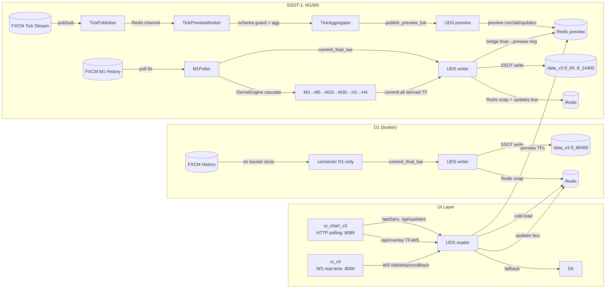
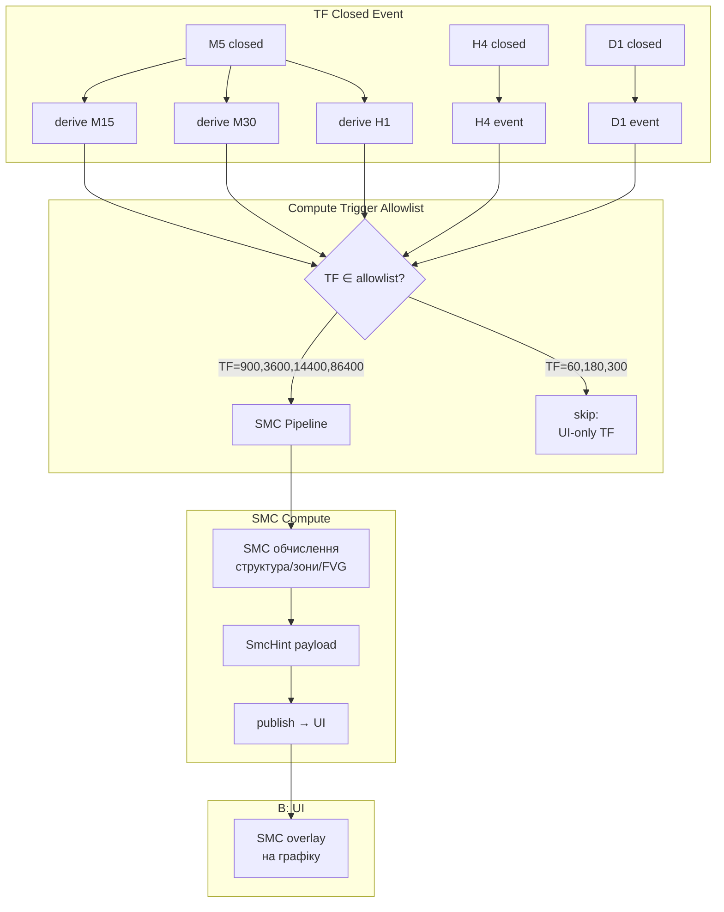
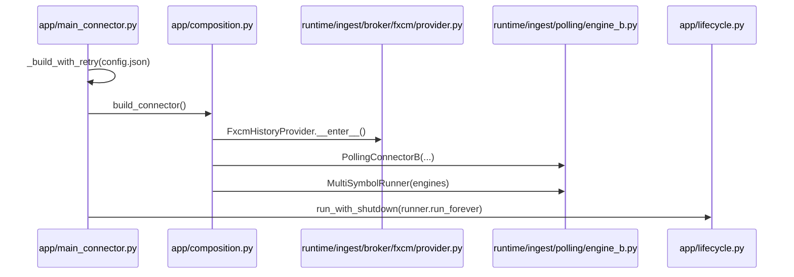
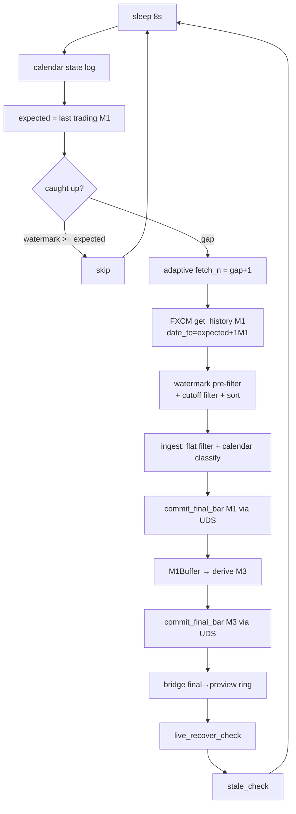
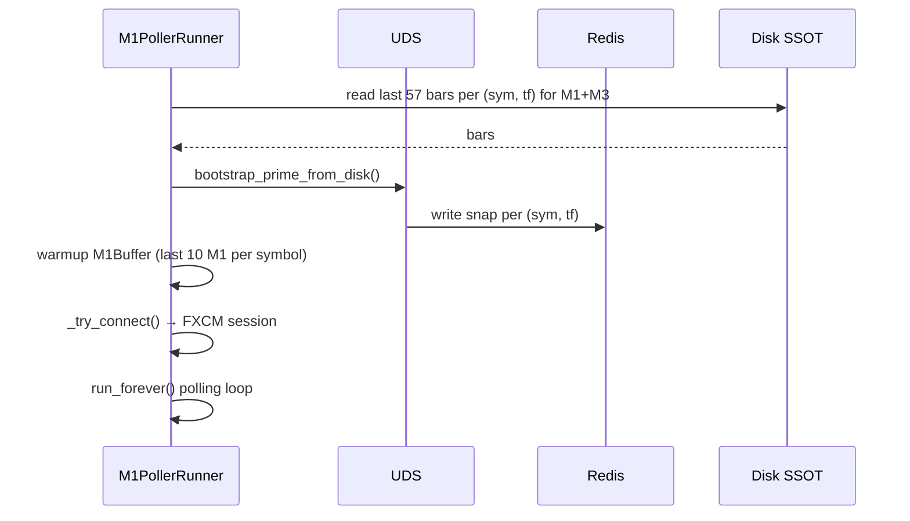
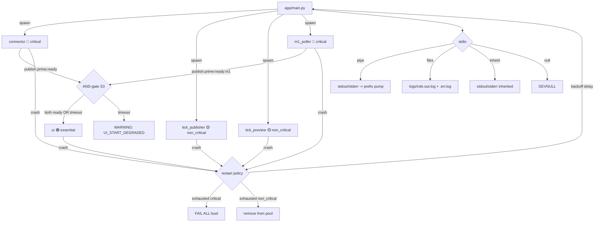
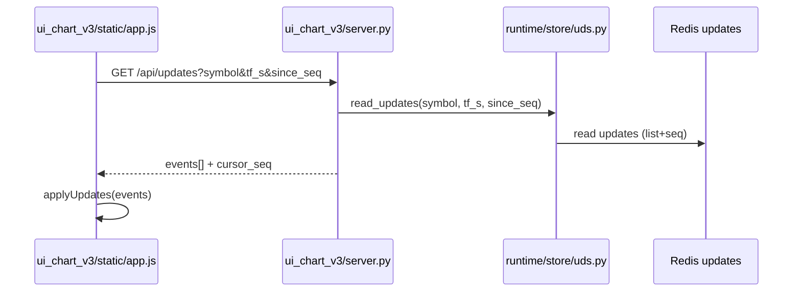
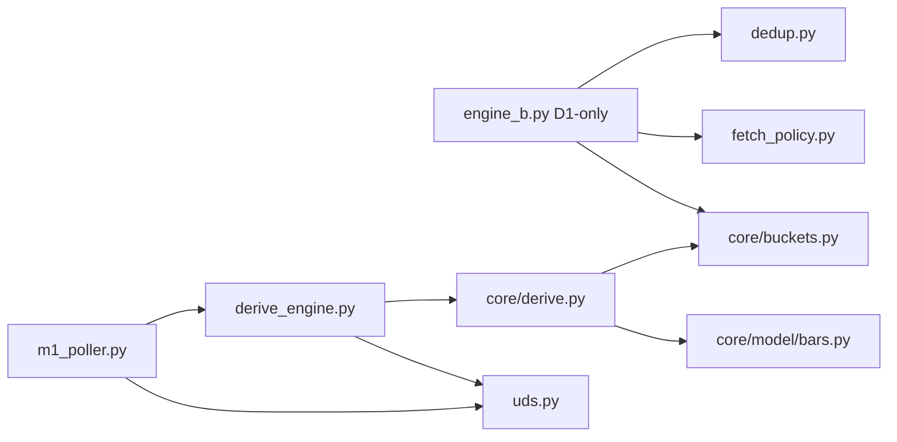
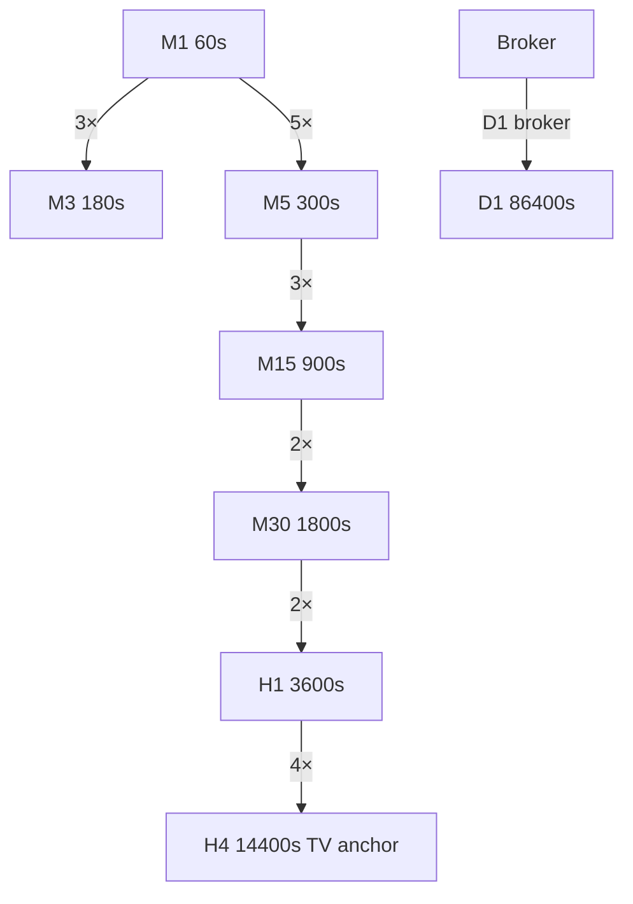

# Поточна система — Архітектурний огляд (SSOT)

> **Останнє оновлення**: 2026-02-22  
> **Навігація**: [docs/index.md](index.md)

Цей файл — SSOT-опис поточної архітектури системи. Див. [docs/index.md](index.md) для навігації по всій документації.

---

## Зміст

1. [Короткий опис](#короткий-опис)
2. [Архітектура процесів](#архітектура-процесів)
3. [SSOT-площини](#ssot-площини-ізольовані)
4. [Dependency Rule / Boundary](#dependency-rule--boundary)
5. [SSOT: де що живе](#ssot-де-що-живе)
6. [Геометрія часу](#геометрія-часу)
7. [Інваріанти (I0–I6)](#інваріанти-i0i6)
8. [Схеми потоків даних (Mermaid)](#схеми-потоків-даних)
9. [UI Render Pipeline](#ui-render-pipeline--повний-потік-даних-актуально)
10. [Annotated tree](#annotated-tree-ascii-актуальний)
11. [Stop-rules та режими](#stop-rules-та-режими)

---

## Короткий опис

Система має **два SSOT-потоки**:

- **M1→H4 derive chain (основний)** — M1 final bars з FXCM History API (m1_poller) → DeriveEngine cascade: M3(3×M1)→M5(5×M1)→M15(3×M5)→M30(2×M15)→H1(2×M30)→H4(4×H1). Всі TF від M1 до H4 деривуються з одного джерела. Preview-plane: tick stream → TickPreviewWorker → Redis preview keyspace.
- **D1 (broker)** — глобальний тренд. D1 з FXCM History API fetch на закритті бакета (engine_b, D1-only mode).

Supervisor (`app.main --mode all`) керує 5 процесами. UDS є центром читання/запису: writer-и пишуть через UDS (SSOT disk + Redis snapshots + updates bus), UI читає через UDS. Preview-plane (M1/M3) живе в Redis keyspace, final-и з M1 poller проходять bridge до preview ring (final>preview). `/api/bars` для всіх TF застосовує PREVIOUS_CLOSE stitching (open[i]=close[i-1]) для TV-like smooth candles; SSOT на диску не модифікується.

> **ADR-0002 завершено**: engine_b M5 polling вимкнено (m5_polling_enabled=false), derived_tfs_s=[]. Всі TF M1→H4 через m1_poller/DeriveEngine.

> **Детальний гайд по отриманню свічок**: [docs/guide_candle_acquisition.md](guide_candle_acquisition.md)

## Архітектура процесів

```text
app.main (supervisor)
  ├── connector             (FXCM History → UDS final → D1 only; M5 polling OFF)
  ├── tick_publisher_fxcm   (ForexConnect tick stream → Redis PubSub)
  ├── tick_preview_worker   (Redis PubSub → UDS preview M1/M3)
  ├── m1_poller             (FXCM M1 History → UDS final M1 + DeriveEngine cascade M3→M5→M15→M30→H1→H4)
  ├── ui                    (HTTP server, port 8089 — ui_chart_v3 polling)
  └── ws_server             (WS server, port 8000 — ui_v4 real-time, config-gated)
```

## SSOT-площини (ізольовані)

```text
┌──────────────────────────────────────────────────────────────┐
│  SSOT-1: M1/M3 (візуальність + точки входу)                  │
│  Джерело: tick stream → preview, FXCM M1 History → final     │
│  Disk: data_v3/{sym}/tf_60/ та tf_180/                       │
│  Процеси: m1_poller (final), tick_publisher+preview_worker   │
│  Ізоляція: НЕ впливає на M5+ pipeline                        │
├──────────────────────────────────────────────────────────────┤
│  SSOT-2: M5→H4 (derived від M1, SMC аналітика)               │
│  Джерело: DeriveEngine cascade з M1 (m1_poller)              │
│  M5=5×M1, M15=3×M5, M30=2×M15, H1=2×M30, H4=4×H1          │
│  Disk: data_v3/{sym}/tf_300..tf_14400/                       │
│  Процес: m1_poller + DeriveEngine                            │
│  engine_b M5 polling OFF (ADR-0002 Phase 5)                  │
├──────────────────────────────────────────────────────────────┤
│  SSOT-3: D1 (глобальний тренд, структурні зони)              │
│  Джерело: FXCM History API (D1 only)                         │
│  Disk: data_v3/{sym}/tf_86400/                               │
│  Процес: connector (D1-only, broker_base fetch on close)     │
│  engine_b = D1-only fetcher (m5_polling_enabled=false)        │
└──────────────────────────────────────────────────────────────┘
```

## Геометрія часу (помітка для всіх розмов про свічки)

**Dual convention (канон):**

| Шар | Поле | Семантика | Формула |
|---|---|---|---|
| CandleBar / SSOT JSONL / HTTP API | `close_time_ms` | **end-excl** | `open_time_ms + tf_s * 1000` |
| Redis (ohlcv / preview:curr / preview:tail) | `close_ms` | **end-incl** | `open_ms + tf_s * 1000 - 1` |

- Конвертація end-excl → end-incl відбувається **тільки** на межі Redis write:
  `redis_snapshot._bar_to_cache_bar`, `redis_snapshot.put_bar`, `uds.publish_preview_bar`.
- При читанні з Redis, UDS перераховує `close_ms = open_ms + tf_s*1000` (end-excl, ігноруючи stored close_ms).
- `event_ts`/`event_ts_ms` додається лише у вихідних payload-ах для `complete=true`, не зберігається у SSOT.

Це рішення є каноном. Будь-які зміни геометрії часу мають проходити через окремий initiative з міграцією і rollback.

## Dependency Rule / Boundary

Шари системи мають строгу ієрархію залежностей:

```text
┌─────────────────────────────────────────────────────────────┐
│  core/        pure-логіка (час, контракти, моделі)          │
│               НЕ імпортує: runtime/, ui/, tools/            │
│               НЕ має I/O: файли, мережа, Redis, FXCM       │
├─────────────────────────────────────────────────────────────┤
│  runtime/     I/O та процеси (ingest, store, pub/sub)       │
│               Імпортує: core/                               │
│               НЕ імпортує: tools/, ui/                      │
├─────────────────────────────────────────────────────────────┤
│  ui_chart_v3/ презентація + HTTP API (same-origin)          │
│               Імпортує: core/ (pure helpers)                │
│               Імпортує: runtime/ (ReadPolicy, UDS types)    │
│               НЕ містить доменної логіки                    │
├─────────────────────────────────────────────────────────────┤
│  app/         запуск, supervisor, lifecycle                  │
│               Імпортує: core/, runtime/ (для build/start)   │
├─────────────────────────────────────────────────────────────┤
│  tools/       одноразові утиліти/діагностика/міграції       │
│               Імпортує: core/ (дозволено)                   │
│               НЕ імпортується з runtime/ui/app              │
└─────────────────────────────────────────────────────────────┘
```

**Enforcement**: `tools/exit_gates/gates/` містить gate для перевірки dependency rule (AST).

## SSOT: де що живе

| Що | Де (файл/модуль) | Примітки |
| --- | --- | --- |
| **Контракти** (JSON Schema) | `core/contracts/public/marketdata_v1/` | bar_v1, window_v1, updates_v1, tick_v1 |
| **Конфіг** (policy SSOT) | `config.json` (довідник: [config_reference.md](config_reference.md)) | Один файл; .env — лише секрети. Секція `bootstrap` — SSOT для warmup/cold-start параметрів (S4, ADR-0003) |
| **Геометрія часу** | `core/model/bars.py`, `core/buckets.py` | end-excl канон: `close_time_ms = open_time_ms + tf_s*1000`; guard: `assert_invariants()` |
| **Дані** (SSOT JSONL) | `data_v3/{symbol}/tf_{tf_s}/part-YYYYMMDD.jsonl` | append-only, final-only |
| **Redis cache** | `{NS}:ohlcv:snap/tail:{sym}:{tf_s}` | Не SSOT; warmup/cold-load кеш |
| **Preview plane** | `{NS}:preview:*` у Redis | Ізольований keyspace; не на диску |
| **Updates bus** | Redis list `{NS}:updates:{sym}:{tf_s}` + seq | Hot-path для /api/updates |
| **TF allowlist** | `config.json → tf_allowlist_s` | `[60, 180, 300, 900, 1800, 3600, 14400, 86400]` |
| **Preview TF allowlist** | `config.json → preview_tick_tfs_s` | `[60, 180]` (M1/M3) |
| **Symbols** | `config.json → symbols` | 13 символів |
| **Day anchors** | `config.json → day_anchor_offset_s*` | H4/D1 bucket alignment |
| **Market calendar** | `config.json → market_calendar_*` | Per-group, single-break, UTC |

## Інваріанти (I0–I6)

| ID | Інваріант | Enforcement |
| --- | --- | --- |
| **I0** | **Dependency Rule**: core/ ← runtime/ ← ui/; tools/ ізольовані | Exit-gate AST перевірка |
| **I1** | **UDS як вузька талія**: всі writes через `commit_final_bar`/`publish_preview_bar`; UI = `role="reader"`, `_ensure_writer_role()` кидає `RuntimeError` | Runtime guard у UDS |
| **I2** | **Єдина геометрія часу**: canonical = epoch_ms int. CandleBar/SSOT/API = end-excl (`close_time_ms = open + tf_s*1000`). Redis ALL = end-incl (`close_ms = open + tf_s*1000 - 1`). Конвертація на межі Redis write (`redis_snapshot`, `uds.publish_preview_bar`). | `core/model/bars.py:assert_invariants`, `_ensure_bar_payload_end_excl` |
| **I3** | **Final > Preview (NoMix)**: `complete=true` (final, `source ∈ {history, derived, history_agg}`) завжди перемагає `complete=false` (preview). NoMix guard у UDS | Watermark + NoMix violation tracking |
| **I4** | **Один update-потік для UI**: UI отримує бари лише через `/api/updates` (upsert events) + `/api/bars` (cold-load). Жодних паралельних каналів | Contract-first API schema |
| **I5** | **Degraded-but-loud**: будь-який fallback/перемикання джерел/geom_fix → `warnings[]`/`meta.extensions`, не silent. `bars=[]` завжди з `warnings[]` (no_data rail) | `_contract_guard_warn_*` + no_data branch |
| **I6** | **Disk hot-path ban (P11)**: disk не читається для polling/updates. Cold-load/switch = `disk_policy="bootstrap"` (тільки 60s після boot). Scrollback = `disk_policy="explicit"` (disk дозволено, але з max_steps=6 + cooldown 0.5s per session). Live updates — тільки Redis bus | `_disk_allowed()` guard у UDS; `SCROLLBACK_MAX_STEPS`/`SCROLLBACK_COOLDOWN_S` у ws_server |

## Stop-rules та режими

### Режими роботи Copilot/розробника

| Режим | Коли | Що дозволено |
| --- | --- | --- |
| **MODE=DISCOVERY** | Аналіз/дослідження | Read-only; кожна теза — з доказом (path:line) |
| **MODE=PATCH** | Мінімальний фікс | ≤150 LOC, ≤1 новий файл, без нових concurrency patterns. Потребує VERIFY + POST |
| **MODE=ADR** | Зміна інваріантів/контрактів/протоколу | ADR документ: проблема → рішення → інваріанти → exit criteria → rollback |

### Stop-rules (зупинись і не «дописуй ще»)

Зупинятись і **не додавати нові фічі**, якщо:

- порушені інваріанти I0–I6
- з'явився split-brain (два паралельні джерела істини для одного UI-стану)
- з'явився silent fallback
- зміна торкається контрактів/даних без плану міграції та rollback
- Copilot починає плодити утиліти/модулі замість правки «вузької талії»

У цих випадках — окремий PATCH, який **лише відновлює інваріант/межу**.

## Схема (потік даних)


```mermaid
flowchart LR
    subgraph SSOT1["SSOT-1: M1/M3"]
        T[(FXCM Tick Stream)] -->|pub/sub| TP[TickPublisher]
        TP -->|Redis channel| TW[TickPreviewWorker]
        TW -->|schema guard + agg| TA[TickAggregator]
        TA -->|publish_preview_bar| U1[UDS preview]
        U1 -->|preview curr/tail/updates| RP[(Redis preview)]
        FXCM1[(FXCM M1 History)] -->|poll 8s| M1P[M1Poller]
        M1P -->|commit_final_bar| U2[UDS writer]
        M1P -->|DeriveEngine cascade| DE[M3→M5→M15→M30→H1→H4]
        DE -->|commit all derived TF| U2
        U2 -->|SSOT write| D1[(data_v3 tf_60..tf_14400)]
        U2 -->|Redis snap + updates bus| R1[(Redis)]
        U2 -->|bridge final→preview ring| RP
    end
    subgraph SSOT3["D1 (broker)"]
        FXCMH[(FXCM History)] -->|on bucket close| P[connector D1-only]
        P -->|commit_final_bar| U3[UDS writer]
        U3 -->|SSOT write| DH[(data_v3 tf_86400)]
        U3 -->|Redis snap| R5[(Redis)]
    end
    subgraph UI["UI Layer"]
        UIc[ui_chart_v3<br/>HTTP polling :8089] -->|/api/bars, /api/updates| UR[UDS reader]
        UIc -->|/api/overlay TF≥M5| UR
        UIv4[ui_v4<br/>WS real-time :8000] -->|WS full/delta/scrollback| UR
        UR -->|cold-load| R5
        UR -->|fallback| D5
        UR -->|preview TFs| RP
        UR -->|updates bus| R5
    end
```

### Схема A: Final OHLCV Pipeline (канонічний потік)

```mermaid
flowchart LR
    subgraph Broker["A: Broker (FXCM)"]
        FX1[(History M1)]
        FXH[(History D1)]
    end
    subgraph Writers["Writers (ingest)"]
        EB[engine_b<br/>D1-only]
        M1P[m1_poller<br/>poll 8s]
        DRV[DeriveEngine<br/>M3→M5→M15→M30→H1→H4]
    end
    subgraph UDS["C: UDS (вузька талія)"]
        CFB[commit_final_bar]
        WM{{watermark guard}}
        DSK[(Disk SSOT<br/>data_v3/*.jsonl)]
        RSN[(Redis snap<br/>ohlcv:snap/tail)]
        UPD[(Updates bus<br/>Redis list+seq)]
        RAM[(RAM LRU)]
    end
    subgraph UI["B: UI (read-only)"]
        BARS[/api/bars]
        UPDE[/api/updates]
    end

    FX1 --> M1P --> CFB
    FXH --> EB --> CFB
    M1P --> DRV --> CFB

    CFB --> WM
    WM -->|OK| DSK
    WM -->|stale/dup| DROP[drop + loud log]
    DSK --> RSN
    DSK --> UPD
    DSK --> RAM

    RSN --> BARS
    UPD --> UPDE
    RAM --> BARS
```

**Інваріанти цього потоку:**

- **I1**: всі writes тільки через `commit_final_bar` (UDS)
- **I3**: final (complete=true, source ∈ {history, derived, history_agg}) = незмінний; дублікати відкидаються watermark
- **I6**: disk = SSOT (append-only); Redis/RAM = cache (NOT hot-path для /api/bars у UI, крім bootstrap)

### Схема B: Preview Pipeline (тіки → M1/M3 preview)

```mermaid
flowchart LR
    subgraph Broker["A: FXCM Tick Stream"]
        OFFERS[(ForexConnect<br/>OFFERS table)]
    end
    subgraph Tick["Tick pipeline"]
        TP[tick_publisher<br/>BID mode]
        PS[(Redis PubSub<br/>price_tick channel)]
        TW[tick_preview_worker<br/>schema guard tick_v1]
        TA[TickAggregator<br/>tf=60/180]
    end
    subgraph UDS_P["C: UDS Preview Plane"]
        PPB[publish_preview_bar]
        PRD[publish_promoted_bar<br/>tick_promoted]
        PCUR[(preview:curr<br/>TTL=1800s)]
        PTAIL[(preview:tail<br/>ring buffer)]
        PUPD[(preview:updates)]
    end
    subgraph Final_Bridge["Final → Preview Bridge"]
        CFB2[commit_final_bar<br/>M1/M3]
        BRG[bridge final→preview<br/>final>preview]
    end
    subgraph UI_P["B: UI"]
        BARSM1[/api/bars tf=60/180]
        UPDM1[/api/updates tf=60/180]
        OVL[/api/overlay]
    end

    OFFERS --> TP --> PS --> TW --> TA
    TA -->|complete=false| PPB --> PCUR
    TA -->|bucket rollover| PRD --> PTAIL
    PPB --> PTAIL
    PPB --> PUPD

    CFB2 --> BRG --> PTAIL

    PCUR --> BARSM1
    PTAIL --> BARSM1
    PUPD --> UPDM1
    PCUR --> OVL
```

**Інваріанти цього потоку:**

- **NoMix**: preview (complete=false) **НЕ** потрапляє в SSOT/JSONL на диску
- **Final > Preview**: final (від m1_poller через bridge) завжди перемагає preview для того ж `(symbol, tf_s, open_ms)`
- **Ізоляція**: preview keyspace (`{NS}:preview:*`) повністю ізольований від final keyspace (`{NS}:ohlcv:*`)
- **Disk не hot-path**: preview живе лише в Redis; disk = recovery/scrollback

### Схема C: Compute Triggers (SMC pipeline — план)


```mermaid
flowchart TD
    subgraph TF_Closed["TF Closed Event"]
        M5C[M5 closed] --> D15[derive M15]
        M5C --> D30[derive M30]
        M5C --> D1h[derive H1]
        H4C[H4 closed] --> H4E[H4 event]
        D1C[D1 closed] --> D1E[D1 event]
    end
    subgraph Trigger["Compute Trigger Allowlist"]
        D15 --> CHK{TF ∈ allowlist?}
        D30 --> CHK
        D1h --> CHK
        H4E --> CHK
        D1E --> CHK
        CHK -->|TF=900,3600,14400,86400| SMC[SMC Pipeline]
        CHK -->|TF=60,180,300| SKIP[skip:<br/>UI-only TF]
    end
    subgraph SMC_Pipe["SMC Compute"]
        SMC --> CALC[SMC обчислення<br/>структура/зони/FVG]
        CALC --> HINT[SmcHint payload]
        HINT --> PUB[publish → UI]
    end
    subgraph UI_SMC["B: UI"]
        PUB --> SMCUI[SMC overlay<br/>на графіку]
    end
```

> **Статус**: SMC compute pipeline — **PARTIAL / TODO**. Базові обчислення реалізовані, але інтеграція тригерів з UDS events ще не завершена. TF allowlist для compute тригерів:
>
> - **Primary**: M15 (900s) — основний TF для SMC
> - **Secondary**: H1 (3600s), H4 (14400s), D1 (86400s) — старші TF для контексту
> - **UI-only** (не тригерять compute): M1 (60s), M3 (180s), M5 (300s)
>
> Це рішення зафіксовано і потребує ADR для зміни.

## Схеми процесів і циклів

## UI Render Pipeline — повний потік даних (актуально)

Cold start:
  init() → loadBarsFull()
    → GET /api/bars?limit=COLD_START_BARS_BY_TF[tf]
    → epoch guard check
    → controller.setBars(data.bars)          // chart_adapter_lite.js:735
      → normalizeBar(bar) each               // chart_adapter_lite.js:165
        → filter(Boolean)                    // drops bars with time<=0 or NaN OHLC
        → sort by time, dedupe by time       // chart_adapter_lite.js:741-751
        → candles.setData(deduped)           // LWC API
        → volumes.setData(volumeData)
    → setBarsStore(data.bars)                // app.js:1207 — caps to MAX_RENDER_BARS_WARM
      → rebuildBarsIndex()                   // Map(open_time_ms → index)
    → saveCacheCurrent()                     // uiCacheByKey.set(key, bars)

Incremental updates:
  pollUpdates() → GET /api/updates?since_seq=...
    → epoch guard, boot_id check
    → applyUpdates(events)                   // app.js:1583
      → sort by seq
      → for each event:
        → drop stale (bar.open_time_ms < lastOpenMs - tfMs)
        → forward gap guard (>3 TF periods → reload)
        → key match check (symbol/tf)
        → final>preview invariant
        → NoMix check
        → controller.updateLastBar(bar)      // chart_adapter_lite.js:793
          → normalizeBar(bar)
          → _rafPending = normalized
          → requestAnimationFrame(_flushChartRender)
            → candles.update(bar)
            → volumes.update(...)
        → upsertBarToStore(bar)              // app.js:1219

Scrollback:
  handleVisibleRangeChange() → ensureLeftCoverage()
    → GET /api/bars?to_open_ms=...&limit=SCROLLBACK_CHUNK
    → mergeOlderBars(olderBars)
    → controller.setBars(barsStore)          // full re-render

### Старт і ініціалізація (connector)


```mermaid
sequenceDiagram
    participant Main as app/main_connector.py
    participant Comp as app/composition.py
    participant Fxcm as runtime/ingest/broker/fxcm/provider.py
    participant Eng as runtime/ingest/polling/engine_b.py
    participant Run as app/lifecycle.py

    Main->>Main: _build_with_retry(config.json)
    Main->>Comp: build_connector()
    Comp->>Fxcm: FxcmHistoryProvider.__enter__()
    Comp->>Eng: PollingConnectorB(...)
    Comp->>Eng: MultiSymbolRunner(engines)
    Main->>Run: run_with_shutdown(runner.run_forever)
```

### M1 Poller цикл (M1 + M3 derive)


```mermaid
flowchart TD
    A[sleep 8s] --> B[calendar state log]
    B --> C[expected = last trading M1]
    C --> D{caught up?}
    D -->|watermark >= expected| E[skip]
    E --> A
    D -->|gap| F[adaptive fetch_n = gap+1]
    F --> G[FXCM get_history M1<br/>date_to=expected+1M1]
    G --> H[watermark pre-filter<br/>+ cutoff filter + sort]
    H --> I[ingest: flat filter + calendar classify]
    I --> J[commit_final_bar M1 via UDS]
    J --> K[M1Buffer → derive M3]
    K --> L[commit_final_bar M3 via UDS]
    L --> M[bridge final→preview ring]
    M --> N[live_recover_check]
    N --> O[stale_check]
    O --> A
```

> **Важливо**: M1 Poller **НЕ має calendar gate** (blocking `if not market_open: return`). Це гарантує що останній бар перед daily break завжди фетчиться. Calendar-aware expected + caught-up check запобігають зайвим fetch під час break/weekend.

### M1 Poller warmup (startup)


```mermaid
sequenceDiagram
    participant R as M1PollerRunner
    participant UDS as UDS
    participant Redis as Redis
    participant Disk as Disk SSOT

    R->>Disk: read last 57 bars per (sym, tf) for M1+M3
    Disk-->>R: bars
    R->>UDS: bootstrap_prime_from_disk()
    UDS->>Redis: write snap per (sym, tf)
    R->>R: warmup M1Buffer (last 10 M1 per symbol)
    R->>R: _try_connect() → FXCM session
    R->>R: run_forever() polling loop
```

### Polling цикл (M5 + derived)

```mermaid
flowchart TD
    A[sleep_to_next_minute] --> B[log calendar state changes]
    B --> C{broker_base_fetch_on_close?}
    C -->|yes| D[fetch_last_n_tf tf=14400/86400]
    C -->|no| E[skip base TF]
    D --> F[fetch_last_n_tf tf=300 (tail)]
    E --> F
    F --> G[ingest M5 (dedup module)]
    G --> H{calendar pause?}
    H -->|trading + flat| Skip[skip flat bar]
    H -->|pause + flat| Accept_PF[accept + ext:calendar_pause_flat]
    H -->|pause + non-flat| Anomaly[WARN anomaly + accept]
    H -->|trading + non-flat| I[derive 15m/30m/1h (derive module)]
    Accept_PF --> I
    Anomaly --> I
    I --> J[commit_final_bar через UDS]
```

### Retry/backoff + календарний сон

```mermaid
flowchart TD
    A[build_connector] -->|ok| B[run_forever]
    A -->|error| C[backoff = base * 2^n]
    C --> D{ORA-499?}
    D -->|yes| E[calendar sleep до open - wake_ahead]
    D -->|no| F[time.sleep(backoff)]
    E --> A
    F --> A
```

### Supervisor (app/main.py --mode all) — ADR-0003 S2+S3


```mermaid
flowchart TD
    A[app/main.py] -->|spawn| B[connector 🔴 critical]
    A -->|spawn| C[tick_publisher 🟡 non_critical]
    A -->|spawn| D[tick_preview 🟡 non_critical]
    A -->|spawn| E[m1_poller 🔴 critical]
    B -->|publish prime:ready| PR{AND-gate S3}
    E -->|publish prime:ready:m1| PR
    PR -->|both ready OR timeout| F[ui 🟢 essential]
    PR -->|timeout| W[WARNING: UI_START_DEGRADED]
    B -->|crash| R{restart policy}
    C -->|crash| R
    D -->|crash| R
    E -->|crash| R
    F -->|crash| R
    R -->|backoff delay| A
    R -->|exhausted critical| X[FAIL ALL loud]
    R -->|exhausted non_critical| Y[remove from pool]
    A --> G{stdio}
    G -->|pipe| H[stdout/stderr -> prefix pump]
    G -->|files| I[logs/role.out.log + .err.log]
    G -->|inherit| J[stdout/stderr inherited]
    G -->|null| K[DEVNULL]
```

### UI polling /api/updates


```mermaid
sequenceDiagram
    participant UI as ui_chart_v3/static/app.js
    participant API as ui_chart_v3/server.py
    participant UDS as runtime/store/uds.py
    participant RU as Redis updates

    UI->>API: GET /api/updates?symbol&tf_s&since_seq
    API->>UDS: read_updates(symbol, tf_s, since_seq)
    UDS->>RU: read updates (list+seq)
    API-->>UI: events[] + cursor_seq
    UI->>UI: applyUpdates(events)
```

### UI scrollback (cover-until-satisfied)

- Тригер: дефіцит лівого буфера (~1000 барів).
- Пачки: базово 1000 (динамічний clamp у межах 500..2000), фаворити x2.
- Ліміти: active до 20000 (через policy + server clamp), warm LRU=6 по 20000.

## Policy SSOT та rails (Slice-1..4)

- `/api/config` є policy-джерелом для UI: `policy_version`, `build_id`, `window_policy`, allowlists.
- `/api/bars` (cold-start) читає через UDS з `prefer_redis=true`, `disk_policy=explicit` (unified для всіх TF).
- `bars=[]` без пояснення заборонено: no_data rail гарантує `warnings[]`.
- RAM short-window повертає partial+loud (`insufficient_warmup`, `meta.extensions.expected/got`) замість `cache_miss -> empty`.

### Модулі polling (залежності)


```mermaid
flowchart LR
    Engine[engine_b.py D1-only] --> Dedup[dedup.py]
    Engine --> Fetch[fetch_policy.py]
    Engine --> CoreBuckets[core/buckets.py]
    CoreDerive[core/derive.py] --> CoreBuckets
    CoreDerive --> CoreBars[core/model/bars.py]
    DeriveEng[derive_engine.py] --> CoreDerive
    DeriveEng --> UDS[uds.py]
    M1Poller[m1_poller.py] --> DeriveEng
    M1Poller --> UDS
```

### Cascade Derive Chain (core/derive.py, ADR-0002 Phase 1)


```mermaid
flowchart TD
    M1[M1 60s] -->|3×| M3[M3 180s]
    M1 -->|5×| M5[M5 300s]
    M5 -->|3×| M15[M15 900s]
    M15 -->|2×| M30[M30 1800s]
    M30 -->|2×| H1[H1 3600s]
    H1 -->|4×| H4[H4 14400s TV anchor]
    Broker -->|D1 broker| D1[D1 86400s]
```

**DERIVE_CHAIN** — декларативний strict cascade (кожен TF від попереднього, не плоска деривація).
`GenericBuffer(tf_s)` — параметричний буфер (замінює M1Buffer + M5Buffer).
`aggregate_bars()` — чиста агрегація. `derive_bar()` + `derive_triggers()` — bucket-орієнтована деривація.

### DeriveEngine (runtime/ingest/derive_engine.py, ADR-0002 Phase 2)

I/O обгортка над core/derive.py. Каскад: `on_bar(M1)` → buffer → triggers → derive → UDS commit → recurse.
`commit_tfs_s` = `set(DERIVE_ORDER)` — всі 6 derived TFs (M3,M5,M15,M30,H1,H4).
`register_symbol_uds()` — shared UDS з m1_poller (без file race).
Per-symbol `threading.Lock` для cascade integrity.

## Annotated tree (ASCII, актуальний)

```text
v3/
├── app/                           # запуск і складання runtime
│   ├── main.py                    # supervisor (--mode all/connector/ui/tick_publisher/tick_preview/m1_poller)
│   ├── main_connector.py          # retry/backoff + calendar sleep (engine_b)
│   ├── composition.py             # build_connector, build_m1_poller, валідація config.json
│   ├── lifecycle.py               # run_with_shutdown + cleanup
│   └── __init__.py
├── core/                          # pure-логіка (час, контракти, моделі) — без I/O
│   ├── config_loader.py           # SSOT: pick_config_path / load_system_config
│   ├── buckets.py                 # bucket_start_ms / resolve_anchor_offset_ms
│   ├── derive.py                  # DERIVE_CHAIN + GenericBuffer + aggregate_bars (cascade pure logic)
│   ├── model/
│   │   └── bars.py                # CandleBar + інваріанти часу
│   └── contracts/
│       └── public/
│           └── marketdata_v1/     # JSON Schema контракти
│               ├── bar_v1.json
│               ├── tick_v1.json
│               ├── updates_v1.json
│               └── window_v1.json
├── runtime/                       # ingest, store, I/O
│   ├── ingest/
│   │   ├── broker/
│   │   │   └── fxcm/
│   │   │       └── provider.py    # FxcmHistoryProvider (FXCM History API, PREVIOUS_CLOSE mode)
│   │   ├── derive_engine.py       # DeriveEngine (cascade I/O: on_bar→buffer→derive→UDS commit, per-symbol lock, ADR-0002 Phase 2)
│   │   ├── market_calendar.py     # MarketCalendar (single-break groups, UTC)
│   │   ├── tick_agg.py            # TickAggregator (preview-plane, tf=60/180)
│   │   ├── tick_common.py         # спільні утиліти для tick pipeline
│   │   ├── tick_preview_worker.py # TickPreviewWorker (tick→preview, schema guard, 0-ticks loud)
│   │   ├── tick_publisher_fxcm.py # FXCM tick publisher (ForexConnect offers→Redis PubSub, BID mode)
│   │   └── polling/
│   │       ├── engine_b.py        # PollingConnectorB (D1-only fetcher, ADR-0002 cleanup done)
│   │       ├── m1_poller.py       # M1Poller (FXCM M1→final, cascade via DeriveEngine M1→M3→…→H4, calendar-aware, watermark, tail_catchup, live_recover, stale)
│   │       ├── dedup.py           # індекси дня, has/mark on-disk
│   │       ├── fetch_policy.py    # політики часу для fetch
│   │       └── README.md          # повний посібник: polling + derive architecture
│   ├── store/
│   │   ├── uds.py                 # UnifiedDataStore (read/write, updates bus, disk_policy rails, short-window loud rail)
│   │   ├── redis_snapshot.py      # Redis snapshots writer
│   │   ├── redis_keys.py          # нормалізація ключів Redis
│   │   ├── redis_spec.py          # resolve Redis connection spec
│   │   ├── ssot_jsonl.py          # JSONL SSOT helpers
│   │   └── layers/
│   │       ├── ram_layer.py       # RAM LRU шар
│   │       ├── redis_layer.py     # Redis read шар
│   │       └── disk_layer.py      # Disk read шар
│   ├── ws/
│   │   ├── ws_server.py           # WS сервер (aiohttp, порт 8000, ui_v4_v2 protocol, UDS reader, config-gated, 770 LOC, scrollback max_steps=6 + cooldown 0.5s)
│   │   └── candle_map.py          # bar→Candle mapping R2 closure (75 LOC)
│   └── obs_60s.py                 # спостереження / метрики (60s intervals)
├── ui_chart_v3/                   # UI + API same-origin (поточний production, HTTP polling)
│   ├── server.py                  # HTTP API + /api/config policy SSOT + no_data loud rail + static server
│   ├── __main__.py                # python -m ui_chart_v3
│   ├── README.md                  # UI документація
│   └── static/
│       ├── index.html             # UI shell
│       ├── app.js                 # polling + applyUpdates + policy consume + scrollback
│       ├── chart_adapter_lite.js  # адаптер Lightweight Charts
│       └── ui_config.json         # portable UI конфіг (api_base, ui_debug)
├── ui_v4/                         # Next-gen UI: Svelte 5 + LWC 5 + TypeScript (WS backend DONE, chart parity DONE, T1-T10 COMPLETE, P3.11-P3.15 DONE)
│   ├── package.json               # deps: lwc@5.0.0, uuid, svelte 5, vite 6, TS 5.7
│   ├── vite.config.ts             # port 5173 (dev), proxy /api/* → 8089
│   ├── dist/                      # vite build output (index.html + assets/); served by ws_server same-origin
│   ├── README_DEV.md              # developer guide
│   ├── UI_v4_COPILOT_README.md    # SSOT інструкція (slices 0–5 plan)
│   └── src/                       # ~4500 LOC, 28 файлів, typecheck 0/0
│       ├── types.ts               # SSOT: RenderFrame, WsAction, Candle, SmcData, Drawing
│       ├── App.svelte             # root wiring: WS + DiagState + keyboard + theme/diag toggle
│       ├── main.ts                # Svelte mount entrypoint
│       ├── app/                   # diagState, diagSelectors, frameRouter (config frame T8), edgeProbe
│       ├── ws/                    # WSConnection (quiet degraded mode), WsAction creators
│       ├── stores/                # cursor price + UI warnings + meta (serverConfig) + favorites (P3.13)
│       ├── layout/                # ChartPane, ChartHud (frosted HUD, theme/style/fav pickers), OhlcvTooltip, StatusBar (+diag btn), StatusOverlay, DiagPanel (P3.14), DrawingToolbar (disabled), SymbolTfPicker
│       └── chart/                 # ChartEngine (LWC, v3-parity, applyTheme/applyCandleStyle), themes.ts (3 themes + 5 candle styles), interaction.ts (Y-zoom/pan/reset), OverlayRenderer, DrawingsRenderer (disabled), geometry
├── aione_top/                     # TUI-монітор процесів/pipeline (standalone, NOT supervisor-managed)
│   ├── __main__.py                # python -m aione_top
│   ├── app.py                     # головний TUI loop (421 LOC, Textual)
│   ├── collectors.py              # збір даних: Redis, HTTP, логи, OBS_60S (651 LOC)
│   ├── display.py                 # рендер TUI таблиць/панелей (773 LOC)
│   ├── actions.py                 # restart/start процесів (262 LOC)
│   └── README.md                  # документація aione_top
├── tools/                         # утиліти / діагностика
│   ├── backfill_cascade.py        # waterfall M1→H4 backfill з calendar-aware derive
│   ├── tail_integrity_scanner.py  # цілісність даних: all symbols × all TFs × N days
│   ├── fetch_m5_isolated.py       # ізольований M5 fetch
│   ├── rebuild_derived.py         # rebuild derived з M5 (legacy, anchor=0)
│   ├── rebuild_m15_isolated.py    # ізольований rebuild 15m
│   ├── purge_broken_bars.py       # чистка пошкоджених JSONL
│   ├── tick_sim_publisher.py      # симуляція тиків для тестів
│   ├── run_exit_gates.py          # runner exit-gates
│   ├── exit_gates/
│   │   ├── manifest.json          # реєстр gates (22 gate-модулі)
│   │   └── gates/                 # gate_*.py (22 файлів)
│   └── diag/
│       ├── check_gaps.py          # перевірка price gaps для всіх TF
│       ├── check_freshness.py     # перевірка свіжості Redis ключів
│       ├── classify_h1_gaps.py    # класифікація H1 gap-ів
│       ├── classify_m5_gaps.py    # класифікація M5 gap-ів
│       ├── clear_redis_cache.py   # очистка Redis кешу
│       └── disk_max_open_ms.py    # макс open_ms на диску
├── config.json                    # SSOT конфіг (один файл)
├── env_profile.py                 # .env → секрети (load_env_secrets)
├── .env                           # тільки секрети (FXCM credentials)
├── data_v3/                       # SSOT дані (JSONL per symbol/tf)
├── logs/                          # runtime логи
├── changelog.jsonl                # детальний журнал змін
├── CHANGELOG.md                   # короткий індекс
├── docs/
│   ├── system_current_overview.md # цей файл
│   ├── ADR-0001 UnifiedDataStore.md # UDS архітектурне рішення
│   └── redis_snapshot_design.md   # дизайн Redis snapshots
├── tests/
│   └── test_tick_agg.py           # тести TickAggregator
└── research/                      # дослідження / POC (не для prod)
```

## Ключові можливості

### Ingest (дві ізольовані data planes)

- **M1→H4 (основний потік)**: M1 poller з FXCM History API (8s cycle, calendar-aware expected, watermark pre-filter, adaptive fetch, date_to bound). Tail catchup на bootstrap (до 5000 барів). Live recover (gap auto-fill з cooldown+budget). Stale detection (720s). DeriveEngine cascade: M3(3×M1)→M5(5×M1)→M15(3×M5)→M30(2×M15)→H1(2×M30)→H4(4×H1). Calendar-pause фільтрація. Preview-plane: tick stream → preview bars в Redis. Final bridge → preview ring (final>preview). BID price mode.
- **D1 (broker)**: engine_b D1-only fetcher (m5_polling_enabled=false). broker_base fetch на закритті D1 бакета + cold start.

### UDS (UnifiedDataStore)

- Write center: всі writes через UDS (SSOT disk + Redis snap + updates bus).
- Read layers: RAM LRU → Redis snap → Disk (arbitration).
- Preview-plane: ізольований Redis keyspace (curr/tail/updates). NoMix guard.
- Bridge: M1/M3 final bars публікуються до preview ring.

### UI

**ui_chart_v3** (поточний production):

- HTTP API: /api/bars, /api/updates, /api/overlay, /api/config (same-origin, порт 8089).
- PREVIOUS_CLOSE stitching: open[i]=close[i-1] для TV-like smooth candles.
- Scrollback: cover-until-satisfied (trigger ~2000, chunk 5000).
- Epoch guard: абортує in-flight запити при switch symbol/TF.

**ui_v4** (next-gen, WS backend DONE, chart parity DONE, audit T1-T10 COMPLETE):

- Svelte 5 runes + TypeScript strict + Vite 6 + LWC 5.0.0. **25 файлів, ~4045 LOC** (typecheck 0/0).
- Transport: WebSocket (`runtime/ws/ws_server.py`, 733 LOC, порт 8000, `/ws`). Протокол: `ui_v4_v2` (full + delta + scrollback + config + heartbeat).
- Same-origin serving (Rule §11): `ws_server.py` роздає `ui_v4/dist/` (index.html + /assets/) на порт 8000. Prod: `npm run build` → `python -m runtime.ws.ws_server`. Dev: `npm run dev` (:5173) + ws_server (:8000).
- 3-layer rendering: LWC candles + SMC overlay canvas + drawings canvas (RAF scheduler, DPR-aware). Drawings/SMC **вимкнені** (T1) до стабілізації.
- CAD-рівень drawings: hline/trend/rect, snap-to-OHLC, selection/hit-testing, drag-edit, eraser, undo/redo (code present, disabled T1).
- DiagState SSOT: 7-рівневий пріоритетний статус, StatusOverlay з hysteresis, quiet degraded mode.
- WS backend: P0-P5 slices done. WS output guards (T6): `_guard_candle_shape` + `_guard_candles_output` on all outgoing frames.
- Config frame (T8/S24): `_build_config_frame()` sent on connect before full frame. Policy bridge: symbols, TFs, delta_poll_interval_s, version.
- Config SSOT (T10/S26): `ws_server.py` → `core.config_loader.load_system_config()` (єдиний SSOT, не дублює).
- Chart parity (P3): engine.ts rewrite (volume, D1 +3h offset, UTC formatters, follow mode, rAF throttle, tooltip). V3 feature-complete.
- Interaction (P3.3-P3.5): Y-zoom (wheel), Y-pan (drag), dblclick auto-reset — `interaction.ts` (385 LOC).
- HUD (P3.1-P3.2): ChartHud.svelte (frosted glass, OHLCV + Δ + UTC clock, streaming dot, pulse, wheel TF cycling).
- OhlcvTooltip (P3.6): crosshair cursor tooltip.
- SymbolTfPicker: SSOT symbols/TFs from server via config frame (T5/T8).

### Supervisor (ADR-0003 S2: process isolation)

- `python -m app.main --mode all` запускає 5 процесів.
- stdio: pipe/files/inherit/null + prefix pump.

**Категорії процесів**:

| Категорія | Процеси | Backoff | Max attempts | При вичерпанні |
|-----------|---------|---------|:---:|---|
| **critical** | connector, m1_poller | base=10s, max=300s | 5 | supervisor fail (kill-all, loud) |
| **non_critical** | tick_publisher, tick_preview | base=5s, max=120s | 10 | видаляється з пулу, інші працюють |
| **essential** | ui, ws_server | base=5s, max=120s | 10 | видаляється з пулу, інші працюють |

**Restart policy** (S2):

- Non-zero exit → restart з exponential backoff (delay = base × 2^(attempt-1), capped at max).
- Clean exit (code=0) → видалити з моніторингу.
- Restart counter reset після 10 хвилин стабільної роботи.
- Non-blocking: restart планується з delay і виконується на наступній ітерації loop; інші процеси моніторяться без затримки.
- Critical exhaustion (5 crashes за <10 хв) → supervisor зупиняє **все** (loud error).
- Non-critical exhaustion → видалено з пулу, решта продовжують.

**Backoff прогресія**:

```
critical:     10s → 20s → 40s → 80s → 160s (5 спроб)
non_critical:  5s → 10s → 20s → 40s → 80s → 120s → 120s → 120s → 120s → 120s (10 спроб)
```

### Календар

- Групи символів з daily break(s) (UTC): одна або кілька пар.
- Calendar-aware expected у M1 poller (без blocking gate).
- Calendar-aware cutoff у connector (через fetch_policy.py).
- Підтримка wrap через північ (start > end, напр. cfd_hk_main 19:00→01:15).

## Ланцюжки дій

### 1) Старт системи (--mode all)

1. Supervisor запускає connector, tick_publisher, tick_preview_worker, m1_poller, ws_server (config-gated).
2. **Connector (D1-only)**: bootstrap D1 з диску → cold start D1 від broker → Redis prime → periodic D1 fetch on close → publishes `prime:ready`.
3. **M1 Poller**: bootstrap Redis priming (M1→H4 з диску) → M1Buffer warmup → DeriveEngine warmup → tail catchup → publishes `prime:ready:m1`.
4. **UI (http)**: supervisor AND-gate чекає `prime:ready` (connector) + `prime:ready:m1` (m1_poller), timeout з `config.json:prime_ready_timeout_s` (default=30s). Якщо timeout → UI стартує з WARNING (degraded-but-loud, S3 ADR-0003).
5. **WS Server**: `ws_server.py` стартує на порті 8000, роздає `ui_v4/dist/` (same-origin), слухає `/ws`. Config-gated (`ws_server.enabled`).
6. **Supervisor loop**: моніторить процеси; crash → auto-restart з backoff (S2, ADR-0003); bootstrap error → degraded mode, NOT crash (S1, ADR-0003).

### 2) Live цикл M5 (connector, engine_b)

1. Кожну хвилину: fetch_last_n_tf(M5, n=12).
2. Dedup + запис через UDS (SSOT + Redis snap + updates bus).
3. Derive 15m/30m/H1 при повному M5-діапазоні.
4. H4/D1: fetch на закритті бакета.

### 3) Live цикл M1/M3 (m1_poller)

1. Кожні 8с: calendar state log → calendar-aware expected → caught-up check → adaptive fetch.
2. FXCM get_history(M1, date_to=expected+1M1) → watermark pre-filter + cutoff filter + sort.
3. Calendar-aware ingest: flat bar classification → commit_final_bar.
4. M1Buffer → derive M3 (з calendar-pause фільтрацією) → commit_final_bar.
5. Bridge: final M1/M3 → preview ring (final>preview).
6. Live recover check (gap > 3 → auto-fill з cooldown+budget).
7. Stale detection (12 хв без нового бару при відкритому ринку → loud WARNING).

### 4) Tick preview (tick_publisher + tick_preview_worker)

1. FXCM ForexConnect offers stream → tick_publisher → Redis PubSub.
2. tick_preview_worker: schema guard → TickAggregator → UDS preview keyspace.
3. UI читає preview_curr для формуючого бару.

### 5) UI reads

**ui_chart_v3** (HTTP polling, порт 8089):

1. `/api/bars`: cold-load з Redis snap → fallback disk. Stitching open[i]=close[i-1].
2. `/api/updates`: Redis updates bus (cursor_seq). Disk лише recovery.
3. `/api/overlay`: ephemeral preview bar для TF≥M5.
4. `/api/gaps`: gap report з `tools/tail_integrity_scanner.py` (summary.json).

**ui_v4** (WebSocket, порт 8000):

1. WS connect → `config` frame (symbols, TFs, delta_poll_interval_s, version) → `full` frame (cold start bars).
2. `delta` frames кожну `delta_poll_interval_s` (default 1.0s) з UDS updates bus.
3. `switch` action → canonical symbol/TF → новий `full` frame.
4. `scrollback` action → `to_ms` → UDS `read_window` → `scrollback` frame.
5. `heartbeat` кожні 30с.

## Примітки

- Warmup/tail роблять FXCM History API запити (ліміт).
- Derived пропускаються при gap у M5 в межах бакета.
- FXCM PREVIOUS_CLOSE працює в рамках одного API batch; cross-batch stitching — у /api/bars.
- Дані data_v3 і History не зберігаються у git.
