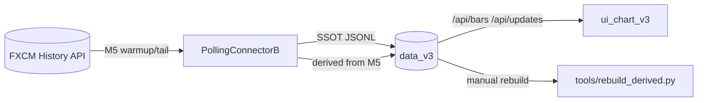

# Поточна система (M5-only)

Цей файл описує актуальний стан системи після спрощення до M5-only.

## Короткий опис

Система працює тільки з M5 як базовим потоком. На старті робиться warmup останніх M5 (history), далі щохвилини підтягування M5 tail (history). Похідні TF (>= 15m) будуються тільки якщо M5-діапазон повний. UI отримує дані з SSOT JSONL через HTTP API.

## Схема (потік даних)



## Annotated tree (ASCII)

```
v3/
|-- app/                         # запуск і складання runtime
|   |-- main.py                  # supervisor (connector + UI)
|   |-- main_connector.py        # запуск PollingConnectorB
|   `-- composition.py           # побудова конектора, конфіг, календарі
|-- core/                        # pure-логіка (час, контракти, моделі)
|   |-- model/                   # CandleBar та інваріанти
|   |-- time_geom.py             # геометрія часу, end-incl
|   `-- buckets.py               # bucket-утиліти
|-- runtime/                     # ingest, store, I/O
|   |-- ingest/                  # FXCM + календар + polling
|   |   |-- broker/              # provider FXCM
|   |   |-- market_calendar.py   # календар (single-break)
|   |   `-- polling/             # M5 ingest + derived
|   `-- store/                   # SSOT JSONL
|-- ui_chart_v3/                 # UI + API same-origin
|   |-- server.py                # /api/bars, /api/updates, /api/config
|   `-- static/                  # фронтенд
|-- tools/                       # локальні утиліти
|   |-- fetch_m5_isolated.py      # ізольований M5 fetch
|   |-- rebuild_derived.py        # rebuild derived з M5
|   |-- rebuild_m15_isolated.py   # ізольований rebuild 15m
|   `-- purge_broken_bars.py      # чистка пошкоджених JSONL
|-- config.json                  # SSOT конфіг (календарі груп)
|-- data_v3/                     # SSOT дані (JSONL)
|-- changelog.jsonl              # детальний журнал
|-- CHANGELOG.md                 # короткий індекс
|-- system_current_overview.md   # цей файл
```

## Ключові можливості

- M5-only ingest: warmup + live tail з history.
- Derived TF: 15m/30m/1h з M5, тільки при повному діапазоні M5.
- Base TF (H4/D1): broker fetch на закритті бакета.
- UI: HTTP API /api/bars, /api/updates, /api/config (same-origin).
- Ручний rebuild: tools/rebuild_derived.py з M5 SSOT.
- Календарі: групи з однією daily break парою (UTC) через config.json.

## Ланцюжки дій

### 1) Старт системи

1. Bootstrap: читаємо останній M5 з диску.
2. Warmup M5 tail: `warmup_bars` останніх M5 з history.
3. Запис у SSOT JSONL, dedup на рівні open_time_ms.
4. UI може запитати /api/bars і отримати історію з диску.

### 2) Live цикл (poll)

1. Кожну хвилину: fetch_last_n_tf(M5, n=12) до останнього закритого M5.
2. Запис нових барів у SSOT (dedup + allow_older).
3. Для кожного нового M5: спроба derived (15m/30m/1h) при повному M5-діапазоні.
4. UI отримує оновлення через /api/updates.

### 3) Base TF (H4/D1)

1. На закритті бакета (торгова хвилина): fetch_last_n_tf(tf, n=1).
2. Якщо open_time збігається з очікуваним b0, бар дописується у SSOT.

### 4) Ручний rebuild derived

1. tools/rebuild_derived.py читає M5 JSONL.
2. Агрегує у TF > 300, кратні 300.
3. Записує тільки відсутні бари (dedup по open_time_ms).

## Примітки

- Warmup і tail роблять API history-запити і витрачають ліміт FXCM.
- Derived пропускаються при будь-якій дірці у M5 в межах бакета.
- Календар (break/weekend) впливає на очікування торгових хвилин у runtime.
